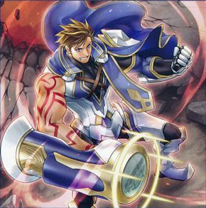
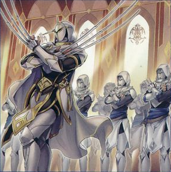

# ドラグマ - モンスター

## 目次
- [ドラグマ - モンスター](#ドラグマ---モンスター)
  - [目次](#目次)
  - [効果モンスター](#効果モンスター)
    - [教導の聖女エクレシア](#教導の聖女エクレシア)
    - [教導の鉄槌テオ](#教導の鉄槌テオ)
    - [教導の天啓アディン](#教導の天啓アディン)
    - [教導の騎士フルルドリス](#教導の騎士フルルドリス)
    - [教導の神徒](#教導の神徒)
    - [教導の大神祇官](#教導の大神祇官)
    - [教導枢機テトラドラグマ](#教導枢機テトラドラグマ)
  - [儀式モンスター](#儀式モンスター)
    - [凶導の白聖骸](#凶導の白聖骸)
    - [凶導の白騎士](#凶導の白騎士)
    - [凶導の白き天底](#凶導の白き天底)
  - [融合モンスター](#融合モンスター)
    - [灰燼竜バスタード](#灰燼竜バスタード)

## 効果モンスター

### 教導の聖女エクレシア

|属性|種族|レベル|ATK|DEF|その他|
|---|---|---|---|---|---|
|光|魔法使い|☆4|1500|1500|-|

|効果①||
|---|---|
|**種別**|起動効果|
|**発動制限**|1ターンに1度(名称指定)|
|**制約**|-|
|**発動条件**|EXデッキから特殊召喚されたモンスターがフィールドに存在する場合|
|**コスト**|-|
|**対象**|-|
|**効果**|このカードを手札から特殊召喚する。|

|効果②||
|---|---|
|**種別**|誘発効果・任意|
|**発動制限**|1ターンに1度(名称指定)|
|**制約**|発動後、ターン終了時まで自分はEXデッキからモンスターを特殊召喚できない。|
|**発動条件**|このカードが召喚・特殊召喚に成功した場合|
|**コスト**|-|
|**対象**|-|
|**効果**|デッキから「教導の聖女エクレシア」以外の「ドラグマ」カード１枚を手札に加える。|

|効果③||
|---|---|
|**種別**|永続効果|
|**発動制限**|-|
|**制約**|-|
|**発動条件**|-|
|**コスト**|-|
|**対象**|-|
|**効果**|このカードはEXデッキから特殊召喚されたモンスターとの戦闘では破壊されない。|

- 【ドラグマ】における初動。
- ①の効果で特殊召喚しても、②の効果を発動しなければ制約は適用されない。
  - 手札から特殊召喚可能なレベル４モンスターとしても運用できる。
- ③の戦闘破壊耐性は、攻撃表示のまま放置するとサンドバッグにされる可能性がある。

---

### 教導の鉄槌テオ

|属性|種族|レベル|ATK|DEF|その他|
|---|---|---|---|---|---|
|光|魔法使い|☆4|1800|1500|-|

|効果①||
|---|---|
|**種別**|起動効果|
|**発動制限**|1ターンに1度(名称指定)|
|**制約**|-|
|**発動条件**|EXデッキから特殊召喚されたモンスターがフィールドに存在する場合|
|**コスト**|-|
|**対象**|-|
|**効果**|このカードを手札から特殊召喚する。|

|効果②||
|---|---|
|**種別**|永続効果|
|**発動制限**|-|
|**制約**|-|
|**発動条件**|-|
|**コスト**|-|
|**対象**|-|
|**効果**|このカードはEXデッキから特殊召喚されたモンスターとの戦闘では破壊されない。|

|効果③||
|---|---|
|**種別**|起動効果|
|**発動制限**|1ターンに1度(名称指定)|
|**制約**|-|
|**発動条件**|-|
|**コスト**|-|
|**対象**|EXデッキから特殊召喚されたフィールドの表側表示モンスター１体|
|**効果**|ターン終了時まで、このカードの攻撃力は６００アップし、対象のモンスターの攻撃力は６００ダウンする。|

- 【ドラグマ】においてはあまり採用されない
- ③の効果を使えば、攻撃力が3000までのモンスターであれば戦闘破壊できる
  - 「教導の騎士フルルドリス」でも同じことができる
  - こちらはリリースなしで通常召喚できるという利点はあるものの、このカードに召喚権を消費するメリットは少ない
- 手札から特殊召喚可能なレベル４モンスターとしても運用できる

---

### 教導の天啓アディン

|属性|種族|レベル|ATK|DEF|その他|
|---|---|---|---|---|---|
|光|魔法使い|☆4|1000|1800|-|

|効果①||
|---|---|
|**種別**|起動効果|
|**発動制限**|1ターンに1度(名称指定)|
|**制約**|-|
|**発動条件**|EXデッキから特殊召喚されたモンスターがフィールドに存在する場合|
|**コスト**|-|
|**対象**|-|
|**効果**|このカードを手札から特殊召喚する。|

|効果②||
|---|---|
|**種別**|永続効果|
|**発動制限**|-|
|**制約**|-|
|**発動条件**|-|
|**コスト**|-|
|**対象**|-|
|**効果**|このカードはEXデッキから特殊召喚されたモンスターとの戦闘では破壊されない。|

|効果③||
|---|---|
|**種別**|起動効果|
|**発動制限**|1ターンに1度(名称指定)|
|**制約**|-|
|**発動条件**|フィールドのこのカードが戦闘・効果で破壊された場合|
|**コスト**|-|
|**対象**|-|
|**効果**|デッキから「教導の天啓アディン」以外の「ドラグマ」モンスター１体を特殊召喚する。|

- 【ドラグマ】においてはあまり採用されない
- ③の効果は「教導の騎士フルルドリス」や「教導の大神祇官」もリクルートできる
  - カジュアル対戦における壁モンスターとしては選択肢に入る
- 手札から特殊召喚可能なレベル４モンスターとしても運用できる

---

### 教導の騎士フルルドリス

|属性|種族|レベル|ATK|DEF|その他|
|---|---|---|---|---|---|
|光|魔法使い|☆8|2500|2500|-|

|効果①||
|---|---|
|**種別**|誘発即時効果|
|**発動制限**|1ターンに1度(名称指定)|
|**制約**|-|
|**発動条件**|**1.** 自分・相手のメインフェイズ **2.** EXデッキから特殊召喚されたモンスターがフィールドに存在する場合|
|**コスト**|-|
|**対象**|-|
|**効果**|**1.** このカードを手札から特殊召喚する。 **2.** 自分フィールドに他の「ドラグマ」モンスターが存在する場合、フィールドの表側表示モンスター１体を選んで効果をターン終了時まで無効にできる。|

|効果②||
|---|---|
|**種別**|誘発効果・任意|
|**発動制限**|1ターンに1度(名称指定)|
|**制約**|-|
|**発動条件**|自分の「ドラグマ」モンスターの攻撃宣言時|
|**コスト**|-|
|**対象**|-|
|**効果**|自分フィールドの全ての「ドラグマ」モンスターの攻撃力は５００アップする。|

---

### 教導の神徒

|属性|種族|レベル|ATK|DEF|その他|
|---|---|---|---|---|---|
|光|魔法使い|☆8|2000|1500|-|

|効果①||
|---|---|
|**種別**|誘発効果・任意|
|**発動制限**|1ターンに1度(名称指定)|
|**制約**|-|
|**発動条件**|融合・S・X・リンクモンスターが自分または相手の墓地へ送られた場合|
|**コスト**|-|
|**対象**|-|
|**効果**|このカードを手札から特殊召喚する。|

|効果②||
|---|---|
|**種別**|誘発効果・任意|
|**発動制限**|1ターンに1度(名称指定)|
|**制約**|-|
|**発動条件**|このカードが手札からの特殊召喚に成功した場合|
|**コスト**|-|
|**対象**|「教導の神徒」以外の自分の墓地の「ドラグマ」カード１枚|
|**効果**|対象のカードを手札に加える。|

|効果③||
|---|---|
|**種別**|誘発効果・任意|
|**発動制限**|1ターンに1度(名称指定)|
|**制約**|-|
|**発動条件**|相手モンスターの攻撃宣言時|
|**コスト**|-|
|**対象**|-|
|**効果**|自分フィールドの全ての「ドラグマ」モンスターの攻撃力は５００アップする。|

- 【ドラグマ】においてはあまり採用されない
- ②の効果はダメージステップでも発動できる

---

### 教導の大神祇官

|属性|種族|レベル|ATK|DEF|その他|
|---|---|---|---|---|---|
|光|魔法使い|☆8|1500|3000|-|

|効果①||
|---|---|
|**種別**|起動効果|
|**発動制限**|1ターンに1度(名称指定)|
|**制約**|-|
|**発動条件**|-|
|**コスト**|自分の墓地から融合・S・X・リンクモンスター１体を除外|
|**対象**|-|
|**効果**|このカードを手札から特殊召喚する。|

|効果②||
|---|---|
|**種別**|起動効果|
|**発動制限**|1ターンに1度(名称指定)|
|**制約**|発動後、ターン終了時まで自分はEXデッキからモンスターを特殊召喚できない。|
|**発動条件**|-|
|**コスト**|-|
|**対象**|-|
|**効果**|**1.** 自分のEXデッキからカード名が異なるモンスター２体を墓地へ送る。 **2.** 相手は自身のEXデッキからモンスター２体を墓地へ送る。|

- 初動にはならないが、展開を伸ばすのに必要な1枚。
- ②の効果は**自身のみ**同名カードを墓地へ送れない点に注意

---

### 教導枢機テトラドラグマ

|属性|種族|レベル|ATK|DEF|その他|
|---|---|---|---|---|---|
|光|魔法使い|☆11|3200|3200|特殊召喚|

|||
|---|---|
|**召喚制限**|**1.** 通常召喚できない **2.** このカードの効果でのみ特殊召喚できる。|

|効果①||
|---|---|
|**種別**|起動効果|
|**発動制限**|-|
|**制約**|-|
|**発動条件**|-|
|**コスト**|-|
|**対象**|自分・相手の墓地の融合・S・X・リンクモンスター合計４体|
|**効果**|1. このカードを手札から特殊召喚する。 2. 対象のモンスターを除外する。|

|効果②||
|---|---|
|**種別**|誘発効果・強制|
|**発動制限**|-|
|**制約**|-|
|**発動条件**|特殊召喚されたモンスターとこのカードが戦闘を行うダメージステップ開始時|
|**コスト**|-|
|**対象**|-|
|**効果**|**1.** 相手フィールドの攻撃表示モンスターを全て破壊する。 **2.** この効果で破壊した融合・S・X・リンクモンスターの数×８００ダメージを相手に与える。|

- ②の除去効果は強力だが、下記の理由からあまり採用されない。
  - 召喚条件が重く、1ターン目での特殊召喚が難しい
  - 妨害効果がない
  - 効果による除去耐性がない
  - 蘇生できない

## 儀式モンスター

### 凶導の白聖骸

|属性|種族|レベル|ATK|DEF|その他|
|---|---|---|---|---|---|
|光|魔法使い|☆4|500|2500|**儀式**|

|効果①||
|---|---|
|**種別**|誘発効果・任意|
|**発動制限**|-|
|**制約**|-|
|**発動条件**|このカードが儀式召喚に成功した場合|
|**コスト**|-|
|**対象**|フィールドの表側表示モンスター２体|
|**効果**|対象モンスターの内１体の攻撃力を、もう１体の攻撃力分アップする。|

|効果②||
|---|---|
|**種別**|永続効果|
|**発動制限**|-|
|**制約**|-|
|**発動条件**|-|
|**コスト**|-|
|**対象**|-|
|**効果**|レベル８以上の自分の「ドラグマ」モンスターは戦闘では破壊されない。|

|効果③||
|---|---|
|**種別**|誘発効果・任意|
|**発動制限**|1ターンに1度(名称指定)|
|**制約**|-|
|**発動条件**|相手のEXデッキからモンスターが特殊召喚された場合|
|**コスト**|-|
|**対象**|-|
|**効果**|相手のEXデッキを確認し、その内のモンスター１体を選んで墓地へ送る。|

- 読み方は「ドラグマのアルバス・セイント」
- ①の効果は単純に打点の底上げになる。
  - 参照されるのは元々の攻撃力ではない。
  - その為、攻撃力の上昇している「教導の騎士フルルドリス」や「凶導の白騎士」を対象にすれば高打点が見込める。
- ②の効果は「凶導の白騎士」を守るのに役立つ。
- 「凶導の葬列」に名称が記載されているため、「儀式の下準備」でサーチ可能。

---

### 凶導の白騎士

|属性|種族|レベル|ATK|DEF|その他|
|---|---|---|---|---|---|
|光|魔法使い|☆8|500|2500|**儀式**|

|効果①||
|---|---|
|**種別**|永続|
|**発動制限**|-|
|**制約**|-|
|**発動条件**|-|
|**コスト**|-|
|**対象**|-|
|**効果**|自分はEXデッキからモンスターを特殊召喚できない。|

|効果②||
|---|---|
|**種別**|誘発効果・任意|
|**発動制限**|1ターンに1度(名称指定)|
|**制約**|-|
|**発動条件**|相手が魔法・罠・モンスターの効果を発動した場合|
|**コスト**|-|
|**対象**|-|
|**効果**|**1.** 自分のEXデッキからモンスター１体を墓地へ送る。 **2.** 相手のEXデッキを確認し、その内のモンスター１体を選んで墓地へ送る。 **3.** このカードの攻撃力はターン終了時まで、墓地へ送ったモンスターの攻撃力を合計した数値の半分だけアップする。|

- 読み方は「ドラグマのアルバス・ナイト」
- フィールドにいるだけでEXデッキからモンスターを一切特殊召喚できなくなる。
  - EXデッキから出さないと割り切った構築なら問題ない
  - 「赫の聖女カルテシア」や【シャドール】、【召喚獣】を混ぜた構築の場合は注意
- ②の効果は相手ターンでも発動できる。
  - 「旧神ヌトス」や「メレオロジック・アグリゲーター」などを落とせば、ドラグマでは数少ない相手ターンに動ける妨害札になる。
- 打点が500なので、「天底の使徒」で「虹光の宣告者」を墓地に送りつつこのカードをサーチできる。
  - 「虹光の宣告者」で「教導の福音」をサーチすればそのまま儀式召喚が可能
  - 「教導の聖女エクレシア」や「凶導の聖告」を経由した方が展開を伸ばせるものの、 手札誘発を警戒するのであれば一考の余地がある。

---

### 凶導の白き天底

|属性|種族|レベル|ATK|DEF|その他|
|---|---|---|---|---|---|
|光|魔法使い|☆12|4000|4000|**儀式**|

|||
|---|---|
|**召喚制限**|「ドラグマ」カードの効果でしか儀式召喚できない。|

|効果①||
|---|---|
|**種別**|永続|
|**発動制限**|-|
|**制約**|-|
|**発動条件**|-|
|**コスト**|-|
|**対象**|-|
|**効果**|自分フィールドの「ドラグマ」モンスターは相手が発動した融合・S・X・リンクモンスターの効果を受けない。|

|効果②||
|---|---|
|**種別**|起動効果|
|**発動制限**|1ターンに1度(名称指定)|
|**制約**|-|
|**発動条件**|-|
|**コスト**|-|
|**対象**|-|
|**効果**|相手は以下a,bの効果から１つを選んで適用する。 **a.** 自身(※このカードのプレイヤーから見た相手)のEXデッキのカード２枚につき１枚、 自身の手札・EXデッキからカードを選んで墓地へ送る。 **b.** 自身のフィールドの融合・S・X・リンクモンスターを全て持ち主のEXデッキに戻す。|

- ①の耐性が強固で、EXデッキに依存するデッキには有利。
  - 戦闘破壊耐性が無い点は注意。
  - 「凶導の白聖骸」を並べられれば戦闘からも守れる。
- ②の効果テキストは途中から相手視点になるので注意。
- 「竜儀巧－メテオニス＝ＤＡＤ」の効果でリクルートできない点は注意。

## 融合モンスター

### 灰燼竜バスタード

|属性|種族|レベル|ATK|DEF|その他|
|---|---|---|---|---|---|
|闇|ドラゴン|☆8|2500|2000|**融合**|

|効果①||
|---|---|
|**種別**|永続効果|
|**発動制限**|-|
|**制約**|-|
|**発動条件**|-|
|**コスト**|-|
|**対象**|-|
|**効果**|このカードの攻撃力は、このカードの融合素材としたモンスターの元々のレベルの合計×１００アップする。|

|効果②||
|---|---|
|**種別**|未分類の効果|
|**発動制限**|-|
|**制約**|-|
|**発動条件**|-|
|**コスト**|-|
|**対象**|-|
|**効果**|このカードが融合召喚に成功したターン、このカードはEXデッキから特殊召喚された他のモンスターが発動した効果を受けない。|

|効果③||
|---|---|
|**種別**|誘発効果・任意|
|**発動制限**|1ターンに1度(名称指定)|
|**制約**|-|
|**発動条件**|このカードが墓地へ送られたターンのエンドフェイズ|
|**コスト**|-|
|**対象**|-|
|**効果**|デッキから「ドラグマ」モンスターまたは「アルバスの落胤」１体を選び、手札に加えるか特殊召喚する。|

- ドラグマ名称は無いが、墓地へ送られたターンのエンドフェイズに 「ドラグマ」モンスターをサーチまたはリクルートできる。
  - 基本は妨害用に「教導の騎士フルルドリス」をサーチする。
  - 「教導の聖女エクレシア」の効果を使っていなければ、「教導の聖女エクレシア」をリクルートし、「教導の騎士フルルドリス」をサーチするでも良い。
  - アルバスの落胤を軸とするなら、「導きの聖女クエム」も可。