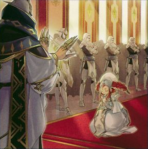

# ドラグマ - 魔法・罠

## 目次
- [ドラグマ - 魔法・罠](#ドラグマ---魔法罠)
  - [目次](#目次)
  - [魔法カード](#魔法カード)
    - [天底の使徒](#天底の使徒)
    - [凶導の福音](#凶導の福音)
    - [凶導の葬列](#凶導の葬列)
    - [烙印の命数](#烙印の命数)
    - [凶導の聖告](#凶導の聖告)
    - [教導神理](#教導神理)
    - [教導国家ドラグマ](#教導国家ドラグマ)
  - [罠カード](#罠カード)
    - [ドラグマ・パニッシュメント](#ドラグマパニッシュメント)
    - [ドラグマ・エンカウンター](#ドラグマエンカウンター)
    - [ドラグマ・ジェネシス](#ドラグマジェネシス)
    - [ドラグマトゥルギー](#ドラグマトゥルギー)

## 魔法カード

### 天底の使徒

|種類|その他|
|---|---|
|通常魔法|-|

|||
|---|---|
|**カードの発動制限**|1ターンに1度(名称指定)|

|効果①||
|---|---|
|**種別**|-|
|**発動制限**|-|
|**制約**|発動後、ターン終了時まで自分はEXデッキからモンスターを特殊召喚できない。|
|**発動条件**|-|
|**コスト**|-|
|**対象**|-|
|**効果**|**1.** EXデッキからモンスター１体を墓地へ送る。 **2.** 墓地へ送ったモンスターの攻撃力以下の攻撃力を持つ、 「ドラグマ」モンスターまたは「アルバスの落胤」１体を自分のデッキ・墓地から選んで手札に加える。|

---

### 凶導の福音

|種類|その他|
|---|---|
|儀式魔法|-|

|||
|---|---|
|**カードの発動制限**|1ターンに1度(名称指定)|

|効果①||
|---|---|
|**種別**|-|
|**発動制限**|-|
|**制約**|発動後、ターン終了時まで自分はEXデッキからモンスターを特殊召喚できない。|
|**発動条件**|-|
|**コスト**|-|
|**対象**|-|
|**効果**|手札から「ドラグマ」儀式モンスター１体を儀式召喚する。 儀式素材は以下a,b**いずれか**の方法で準備する。 **a.** レベルの合計が儀式召喚するモンスターと同じになるように自分の手札・フィールドのモンスターをリリースする。 **b.** 儀式召喚するモンスターと同じレベルのモンスター１体をEXデッキから墓地へ送る。|

---

### 凶導の葬列

|種類|その他|
|---|---|
|儀式魔法|-|

|||
|---|---|
|**カードの発動制限**|1ターンに1度(名称指定)|

|効果①||
|---|---|
|**種別**|-|
|**発動制限**|-|
|**制約**|-|
|**発動条件**|-|
|**コスト**|-|
|**対象**|-|
|**効果**|**1.** 手札・墓地から「ドラグマ」儀式モンスター１体を儀式召喚する。 レベルの合計が儀式召喚するモンスターのレベル以上になるよう、儀式素材を以下a,bの方法で準備する。 **a.** 自分の手札・フィールドのモンスターをリリースする。 **b.** 自分の墓地の融合・Sモンスターを除外する。  **2.** フィールドに「凶導の白騎士」及び「凶導の白聖骸」が存在する場合、 自分または相手のEXデッキを確認し、その内のモンスター１体を選んで墓地へ送る事ができる。|

---

### 烙印の命数

|種類|その他|
|---|---|
|永続魔法|-|

|||
|---|---|
|**カードの発動制限**|-|

|効果①||
|---|---|
|**種別**|誘発効果・任意|
|**発動制限**|1ターンに1度(名称指定)|
|**制約**|-|
|**発動条件**|自分が魔法カードの効果で儀式モンスター１体のみを特殊召喚した場合|
|**コスト**|-|
|**対象**|-|
|**効果**|自分または相手のEXデッキを確認し、その内のモンスター１体を選んで墓地へ送る。|

|効果②||
|---|---|
|**種別**|誘発効果・任意|
|**発動制限**|1ターンに1度(名称指定)|
|**制約**|-|
|**発動条件**|自分が魔法カードの効果で融合モンスター１体のみを特殊召喚した場合|
|**コスト**|-|
|**対象**|その融合モンスター１体|
|**効果**|対象のモンスターはターン終了時まで、攻撃力が自身の元々の攻撃力分アップし、 相手フィールドの攻撃表示モンスターにしか攻撃できない。|

---

### 凶導の聖告

|種類|その他|
|---|---|
|永続魔法|-|

|||
|---|---|
|**カードの発動制限**|1ターンに1度(名称指定)|

|効果①||
|---|---|
|**種別**|-|
|**発動制限**|-|
|**制約**|-|
|**発動条件**|このカードの発動時|
|**コスト**|-|
|**対象**|-|
|**効果**|**1.** デッキから「ドラグマ」儀式モンスター１体または「ドラグマ」儀式魔法カード１枚を手札に加える。 **2.** 相手フィールドにモンスターが存在する場合、さらにデッキから「ドラグマ」カード１枚を手札に加える事ができる。|

|効果②||
|---|---|
|**種別**|起動効果|
|**発動制限**|1ターンに1度|
|**制約**|-|
|**発動条件**|自分フィールドに「ドラグマ」儀式モンスターが存在する場合|
|**コスト**|-|
|**対象**|その融合モンスター１体|
|**効果**|自分または相手のEXデッキを確認し、その内のモンスター１体を選んで墓地へ送る。|

---

### 教導神理

|種類|その他|
|---|---|
|装備魔法|-|

|||
|---|---|
|**カードの発動制限**|-|

|効果①||
|---|---|
|**種別**|-|
|**発動制限**|-|
|**制約**|-|
|**発動条件**|-|
|**コスト**|-|
|**対象**|-|
|**効果**|**a.** 装備モンスターが「ドラグマ」モンスターの場合、装備モンスターの攻撃力は自身のレベル×１００アップする。 **b.** 「ドラグマ」モンスター以外の場合、装備モンスターの攻撃力は自分フィールドの「ドラグマ」モンスターの数×２００ダウンする。|

|効果②||
|---|---|
|**種別**|誘発効果・任意|
|**発動制限**|1ターンに1度(名称指定)|
|**制約**|-|
|**発動条件**|装備モンスターが破壊された事でこのカードが墓地へ送られた場合|
|**コスト**|-|
|**対象**|-|
|**効果**|EXデッキからモンスター１体を墓地へ送る。|

---

### 教導国家ドラグマ

|種類|その他|
|---|---|
|フィールド魔法|-|

|||
|---|---|
|**カードの発動制限**|-|

|効果①||
|---|---|
|**種別**|永続効果|
|**発動制限**|-|
|**制約**|-|
|**発動条件**|-|
|**コスト**|-|
|**対象**|-|
|**効果**|自分フィールドの「ドラグマ」モンスターはEXデッキから特殊召喚されたモンスターの効果の対象にならない。|

|効果②||
|---|---|
|**種別**|誘発効果・任意|
|**発動制限**|1ターンに1度(名称指定)|
|**制約**|-|
|**発動条件**|自分の「ドラグマ」モンスターが相手モンスターと戦闘を行ったダメージ計算後|
|**コスト**|-|
|**対象**|-|
|**効果**|その相手モンスターを破壊する。|

|効果③||
|---|---|
|**種別**|誘発効果・任意|
|**発動制限**|1ターンに1度(名称指定)|
|**制約**|-|
|**発動条件**|フィールドゾーンの表側表示のこのカードが相手の効果で破壊された場合|
|**コスト**|-|
|**対象**|-|
|**効果**|お互いはそれぞれ自身のEXデッキからモンスター１体を墓地へ送る。|

## 罠カード

### ドラグマ・パニッシュメント

|種類|その他|
|---|---|
|通常罠|-|

|||
|---|---|
|**カードの発動制限**|1ターンに1度(名称指定)|

|効果①||
|---|---|
|**種別**|-|
|**発動制限**|-|
|**制約**|このカードの発動後、次の自分ターンの終了時まで自分はEXデッキからモンスターを特殊召喚できない。|
|**発動条件**|-|
|**コスト**|-|
|**対象**|相手フィールドの表側表示モンスター１体|
|**効果**|**1.** そのモンスターの攻撃力以上の攻撃力を持つモンスター１体をEXデッキから墓地へ送る。 **2.** 対象のモンスターを破壊する。|

---

### ドラグマ・エンカウンター

|種類|その他|
|---|---|
|通常罠|-|

|||
|---|---|
|**カードの発動制限**|1ターンに1度(名称指定)|

|効果①||
|---|---|
|**種別**|-|
|**発動制限**|-|
|**制約**|-|
|**発動条件**|-|
|**コスト**|-|
|**対象**|-|
|**効果**|以下の効果から１つを選択して発動できる。 **a.** 手札から「ドラグマ」モンスターまたは「アルバスの落胤」１体を特殊召喚する。 **b.** 自分の墓地から「ドラグマ」モンスターまたは「アルバスの落胤」１体を選び、手札に加えるか特殊召喚する。|

---

### ドラグマ・ジェネシス

|種類|その他|
|---|---|
|通常罠|-|

|||
|---|---|
|**カードの発動制限**|1ターンに1度(名称指定)|

|効果①||
|---|---|
|**種別**|-|
|**発動制限**|-|
|**制約**|-|
|**発動条件**|-|
|**コスト**|-|
|**対象**|**ⅰ.** 除外されている自分または相手の融合・S・X・リンクモンスター１体 **ⅱ.** ⅰと同じ種類（融合・S・X・リンク）の相手フィールドの効果モンスター１体|
|**効果**|**1.** 対象ⅰのモンスターを持ち主のEXデッキに戻す **2.** 対象ⅱのモンスターの効果を無効にする。|

---

### ドラグマトゥルギー

|種類|その他|
|---|---|
|通常罠|-|

|||
|---|---|
|**カードの発動制限**|-|

|効果①||
|---|---|
|**種別**|-|
|**発動制限**|1ターンに1度(名称指定) **※効果②と同じターンには使用不可**|
|**制約**|-|
|**発動条件**|-|
|**コスト**|-|
|**対象**|-|
|**効果**|手札・デッキから「ドラグマ」儀式モンスター１体を儀式召喚する。 儀式素材は以下の方法で準備する。 **a.** レベルの合計が儀式召喚するモンスターと同じになるように、自分フィールドの、「ドラグマ」モンスターまたは儀式・融合・Sモンスターをリリースする。|

|効果②||
|---|---|
|**種別**|誘発即時効果|
|**発動制限**|1ターンに1度(名称指定) **※効果①と同じターンには使用不可**|
|**制約**|-|
|**発動条件**|-|
|**コスト**|墓地のこのカードを除外|
|**対象**|レベルが異なる自分の墓地の「ドラグマ」モンスター２体|
|**効果**|その２体のモンスターの内、１体を手札に加え、もう１体をデッキの一番下に戻す。|