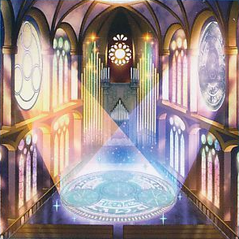

# 汎用カード（儀式関連)

## 目次
- [汎用カード（儀式関連)](#汎用カード儀式関連)
  - [目次](#目次)
  - [宣告者](#宣告者)
    - [虹光の宣告者](#虹光の宣告者)
    - [宣告者の神巫](#宣告者の神巫)
  - [魔神儀](#魔神儀)
    - [魔神儀－キャンドール](#魔神儀キャンドール)
    - [魔神儀－タリスマンドラ](#魔神儀タリスマンドラ)
    - [魔神儀－カリスライム](#魔神儀カリスライム)
    - [魔神儀の祝誕](#魔神儀の祝誕)
  - [その他](#その他)
    - [儀式の準備](#儀式の準備)
    - [儀式の下準備](#儀式の下準備)
    - [祝福の教会－リチューアル・チャーチ](#祝福の教会リチューアルチャーチ)
    - [古聖戴サウラヴィス](#古聖戴サウラヴィス)
    - [竜姫神サフィラ](#竜姫神サフィラ)
    - [祝祷の聖歌](#祝祷の聖歌)
    - [トランソニックバード](#トランソニックバード)
    - [音速を追う者](#音速を追う者)

## 宣告者

### 虹光の宣告者

|属性|種族|レベル|ATK|DEF|その他|
|---|---|---|---|---|---|
|光|天使|☆4|600|1000|**シンクロ**|

|||
|---|---|
|**シンクロ素材**|**1.** チューナー **2.** チューナー以外のモンスター１体以上|

|効果①||
|---|---|
|**種別**|永続効果|
|**発動制限**|-|
|**制約**|-|
|**発動条件**|-|
|**コスト**|-|
|**対象**|-|
|**効果**|このカードがモンスターゾーンに存在する限り、 お互いの手札・デッキから墓地へ送られるモンスターは墓地へは行かず除外される。|

|効果②||
|---|---|
|**種別**|誘発効果・任意|
|**発動制限**|-|
|**制約**|-|
|**発動条件**|モンスターの効果・魔法・罠カードが発動した時|
|**コスト**|このカードをリリース|
|**対象**|-|
|**効果**|その発動を無効にし破壊する。|

|効果③||
|---|---|
|**種別**|誘発効果・任意|
|**発動制限**|-|
|**制約**|-|
|**発動条件**|このカードが墓地へ送られた場合|
|**コスト**|-|
|**対象**|-|
|**効果**|デッキから儀式モンスター１体または儀式魔法カード１枚を手札に加える。|

- 儀式デッキでは、主に「宣告者の神巫」の効果①でEXデッキから直接墓地へ送り、効果③の発動を狙う。
- 効果③は名称ターン1制限が無い

---

### 宣告者の神巫

|属性|種族|レベル|ATK|DEF|その他|
|---|---|---|---|---|---|
|光|天使|☆2|500|300||

|効果①||
|---|---|
|**種別**|誘発効果・任意|
|**発動制限**|1ターンに1度(名称指定)|
|**制約**|-|
|**発動条件**|このカードが召喚・特殊召喚に成功した場合|
|**コスト**|-|
|**対象**|-|
|**効果**|**1.** デッキ・EXデッキから天使族モンスター１体を墓地へ送る。 **2.** このカードのレベルはターン終了時まで、墓地へ送ったモンスターのレベル分だけ上がる。|

|効果②||
|---|---|
|**種別**|誘発効果・任意|
|**発動制限**|1ターンに1度(名称指定)|
|**制約**|-|
|**発動条件**|このカードがリリースされた場合|
|**コスト**|-|
|**対象**|-|
|**効果**|手札・デッキから「宣告者の神巫」以外のレベル２以下の天使族モンスター１体を特殊召喚する。|

- 儀式デッキでは、主に「虹光の宣告者」を墓地へ送るのに使う
- 「虹光の宣告者」と違い、効果①②それぞれに名称ターン1制限がある点に注意

## 魔神儀

### 魔神儀－キャンドール

|属性|種族|レベル|ATK|DEF|その他|
|---|---|---|---|---|---|
|光|炎|☆4|0|0||

|効果①||
|---|---|
|**種別**|起動効果|
|**発動制限**|1ターンに1度(名称指定) **※効果②と同じターンには使用不可**|
|**制約**|-|
|**発動条件**|-|
|**コスト**|手札の儀式魔法カード１枚を相手に見せる|
|**対象**|-|
|**効果**|以下２体のモンスターを特殊召喚する。 　**1.** 「魔神儀－キャンドール」以外のデッキの「魔神儀」モンスター１体 　**2.** 手札のこのカード|

|効果②||
|---|---|
|**種別**|誘発効果・任意|
|**発動制限**|1ターンに1度(名称指定) **※効果①と同じターンには使用不可**|
|**制約**|-|
|**発動条件**|このカードがデッキからの特殊召喚に成功した場合|
|**コスト**|-|
|**対象**|-|
|**効果**|デッキから儀式魔法カード１枚を手札に加える。|

|効果③||
|---|---|
|**種別**|永続効果|
|**発動制限**|-|
|**制約**|-|
|**発動条件**|-|
|**コスト**|-|
|**対象**|-|
|**効果**|このカードがモンスターゾーンに存在する限り、 自分はEXデッキからモンスターを特殊召喚できない。|

---

### 魔神儀－タリスマンドラ

|属性|種族|レベル|ATK|DEF|その他|
|---|---|---|---|---|---|
|闇|植物|☆6|0|0||

|効果①||
|---|---|
|**種別**|起動効果|
|**発動制限**|1ターンに1度(名称指定) **※効果②と同じターンには使用不可**|
|**制約**|-|
|**発動条件**|-|
|**コスト**|手札の儀式モンスター１体を相手に見せる|
|**対象**|-|
|**効果**|以下２体のモンスターを特殊召喚する。 　**1.** 「魔神儀－タリスマンドラ」以外のデッキの「魔神儀」モンスター１体 　**2.** 手札のこのカード|

|効果②||
|---|---|
|**種別**|誘発効果・任意|
|**発動制限**|1ターンに1度(名称指定) **※効果①と同じターンには使用不可**|
|**制約**|-|
|**発動条件**|このカードがデッキからの特殊召喚に成功した場合|
|**コスト**|-|
|**対象**|-|
|**効果**|デッキから儀式モンスター１体を手札に加える。|

|効果③||
|---|---|
|**種別**|永続効果|
|**発動制限**|-|
|**制約**|-|
|**発動条件**|-|
|**コスト**|-|
|**対象**|-|
|**効果**|このカードがモンスターゾーンに存在する限り、 自分はEXデッキからモンスターを特殊召喚できない。|

---

### 魔神儀－カリスライム

|属性|種族|レベル|ATK|DEF|その他|
|---|---|---|---|---|---|
|闇|水|☆7|2500|1800|**儀式**|

|効果①||
|---|---|
|**種別**|起動効果|
|**発動制限**|1ターンに1度(名称指定) **※効果②と同じターンには使用不可**|
|**制約**|発動後、このターン中に自分が儀式モンスターの特殊召喚に成功しなかった場合、 エンドフェイズに自分は２５００LPを失う。|
|**発動条件**|-|
|**コスト**|手札のこのカードを相手に見せる|
|**対象**|-|
|**効果**|**1.** 手札を１枚選んで捨てる。 **2.** デッキから「魔神儀」モンスター１体を特殊召喚する。|

|効果②||
|---|---|
|**種別**|起動効果|
|**発動制限**|1ターンに1度(名称指定) **※効果①と同じターンには使用不可**|
|**制約**|-|
|**発動条件**|-|
|**コスト**|手札及び自分フィールドの表側表示のカードの中から、 「魔神儀」カード１枚を墓地へ送る|
|**対象**|相手フィールドのモンスター１体|
|**効果**|対象のモンスターを破壊する。|

---

### 魔神儀の祝誕

|種類|その他|
|---|---|
|儀式魔法|-|

|||
|---|---|
|**カードの発動制限**|-|

|効果①||
|---|---|
|**種別**|-|
|**発動制限**|-|
|**制約**|-|
|**発動条件**|-|
|**コスト**|-|
|**対象**|-|
|**効果**|手札から儀式モンスター１体を儀式召喚する。 レベルの合計が儀式召喚するモンスターのレベル以上になるよう、儀式素材を以下aの方法で準備する。 　**a.** 自分の手札・フィールドの「魔神儀」モンスターをリリースする。|

|効果②||
|---|---|
|**種別**|起動効果|
|**発動制限**|1ターンに1度(名称指定)|
|**制約**|-|
|**発動条件**|このカードが墓地に存在|
|**コスト**|手札及び自分フィールドの表側表示のカードの中から、 「魔神儀の祝誕」以外の「魔神儀」カード１枚を墓地へ送る|
|**対象**|-|
|**効果**|**1.** デッキから「魔神儀」モンスター１体を特殊召喚する。 **2.** 墓地のこのカードを手札に加える。|

## その他

### 儀式の準備

|種類|その他|
|---|---|
|通常魔法|-|

|||
|---|---|
|**カードの発動制限**|-|

|効果①||
|---|---|
|**種別**|-|
|**発動制限**|-|
|**制約**|-|
|**発動条件**|-|
|**コスト**|-|
|**対象**|-|
|**効果**|**1.** デッキからレベル７以下の儀式モンスター１体を手札に加える。 **2.** 自分の墓地から儀式魔法カード１枚を選んで手札に加える事ができる。|

---

### 儀式の下準備

|種類|その他|
|---|---|
|通常魔法|-|

|||
|---|---|
|**カードの発動制限**|1ターンに1度(名称指定)|

|効果①||
|---|---|
|**種別**|-|
|**発動制限**|-|
|**制約**|-|
|**発動条件**|-|
|**コスト**|-|
|**対象**|-|
|**効果**|**1.** デッキから儀式魔法カード１枚を選ぶ。 **2.** その儀式魔法カードにカード名が記された儀式モンスター１体を自分のデッキ・墓地から選ぶ。 **3.** そのカード２枚を手札に加える。|

---

### 祝福の教会－リチューアル・チャーチ

|種類|その他|
|---|---|
|フィールド魔法|-|

|||
|---|---|
|**カードの発動制限**|-|

|効果①||
|---|---|
|**種別**|起動効果|
|**発動制限**|1ターンに1度(名称指定)|
|**制約**|-|
|**発動条件**|-|
|**コスト**|手札から魔法カード１枚を捨てる|
|**対象**|-|
|**効果**|デッキから以下どちらかのカードを手札に加える。 　**a.** 光属性の儀式モンスター１体 　**b.** 儀式魔法カード１枚|

|効果②||
|---|---|
|**種別**|起動効果|
|**発動制限**|1ターンに1度(名称指定)|
|**制約**|-|
|**発動条件**|-|
|**コスト**|自分の墓地の魔法カードを任意の数だけデッキに戻す|
|**対象**|戻した数と同じレベルを持つ、自分の墓地の天使族・光属性モンスター１体|
|**効果**|対象のモンスターを特殊召喚する。|

---

### 古聖戴サウラヴィス

|属性|種族|レベル|ATK|DEF|その他|
|---|---|---|---|---|---|
|光|ドラゴン|☆7|2600|2800|**儀式**|

|効果①||
|---|---|
|**種別**|誘発効果・任意|
|**発動制限**|-|
|**制約**|-|
|**発動条件**|自分フィールドのモンスターを対象とする 魔法・罠・モンスターの効果を相手が発動した時|
|**コスト**|このカードを手札から捨てる|
|**対象**|-|
|**効果**|その効果の発動を無効にする。|

|効果②||
|---|---|
|**種別**|誘発効果・任意|
|**発動制限**|-|
|**制約**|-|
|**発動条件**|相手がモンスターを特殊召喚する際|
|**コスト**|フィールドのこのカードを手札に戻す|
|**対象**|-|
|**効果**|その特殊召喚を無効にし、そのモンスターを除外する。|

- 効果②はチェーンを組まない特殊召喚に対して使用できる。

---

### 竜姫神サフィラ

|属性|種族|レベル|ATK|DEF|その他|
|---|---|---|---|---|---|
|光|ドラゴン|☆6|2500|2400|**儀式**|

|効果①||
|---|---|
|**種別**|誘発効果・任意|
|**発動制限**|1ターンに1度(名称指定)|
|**制約**|-|
|**発動条件**|以下いずれかのタイミング **1.** このカードが儀式召喚したターンのエンドフェイズ **2.** このカードがモンスターゾーンに存在し、手札・デッキから 光属性モンスターが墓地へ送られたターンのエンドフェイズ|
|**コスト**|-|
|**対象**|-|
|**効果**|以下a,b,cの効果から１つを選択して発動できる。 　**a.** 自分はデッキから２枚ドローし、その後手札を１枚選んで捨てる。 　**b.** 相手の手札をランダムに１枚選んで墓地へ捨てる。 　**c.** 自分の墓地の光属性モンスター１体を選んで手札に加える。|

- 効果を使うためには、エンドフェイズまでこのカードをフィールドに維持する必要がある点は注意 
- 【粛声】ではテーマ内に上位互換がいるためあまり使われない

### 祝祷の聖歌

|種類|その他|
|---|---|
|儀式魔法|-|

|||
|---|---|
|**カードの発動制限**|-|

|効果①||
|---|---|
|**種別**|-|
|**発動制限**|-|
|**制約**|-|
|**発動条件**|-|
|**コスト**|-|
|**対象**|-|
|**効果**|手札から「竜姫神サフィラ」を儀式召喚する。 レベルの合計が６以上になるよう、儀式素材を以下aの方法で準備する。 　**a.** 自分の手札・フィールドのモンスターをリリースする。|

|効果②||
|---|---|
|**種別**|誘発効果・任意|
|**発動制限**|-|
|**制約**|-|
|**発動条件**|自分フィールドの儀式モンスターが戦闘・効果で破壊される場合|
|**コスト**|-|
|**対象**|-|
|**効果**|儀式モンスターが破壊される代わりに墓地のこのカードを除外できる。|

---

### トランソニックバード

|属性|種族|レベル|ATK|DEF|その他|
|---|---|---|---|---|---|
|闇|鳥獣|☆4|0|2400|**儀式**|

|効果①||
|---|---|
|**種別**|誘発効果・任意|
|**発動制限**|1ターンに1度|
|**制約**|-|
|**発動条件**|-|
|**コスト**|-|
|**対象**|-|
|**効果**|**1.** 手札の儀式魔法カード１枚を相手に見せる。 **2.** 見せたカードにカード名が記された儀式モンスター１体をデッキから手札に加える。　 **3.** 見せた儀式魔法カードをデッキに戻す。|

|効果②||
|---|---|
|**種別**|誘発即時効果|
|**発動制限**|1ターンに1度|
|**制約**|-|
|**発動条件**|相手ターン中|
|**コスト**|デッキから儀式魔法カード１枚を墓地へ送る|
|**対象**|-|
|**効果**|この効果は、その儀式魔法カード発動時の儀式召喚する効果と同じになる。|

|効果③||
|---|---|
|**種別**|誘発効果・任意|
|**発動制限**|-|
|**制約**|-|
|**発動条件**|儀式召喚したこのカードがリリースされた場合|
|**コスト**|-|
|**対象**|相手フィールドの表側表示のカード１枚|
|**効果**|対象のカードの効果をターン終了時まで無効にする。|

---

### 音速を追う者

|種類|その他|
|---|---|
|儀式魔法|-|

|||
|---|---|
|**カードの発動制限**|-|

|効果①||
|---|---|
|**種別**|-|
|**発動制限**|-|
|**制約**|-|
|**発動条件**|-|
|**コスト**|-|
|**対象**|-|
|**効果**|**1.** 手札から「トランソニックバード」を儀式召喚する。 レベルの合計が４以上になるよう、儀式素材を以下aの方法で準備する。 　**a.** 自分の手札・フィールドのモンスターをリリースする。  **2.** この効果で特殊召喚したモンスターのレベルは、 その儀式召喚に使用したモンスターのレベルを合計したレベルになる。|

|効果②||
|---|---|
|**種別**|起動効果|
|**発動制限**|-|
|**制約**|-|
|**発動条件**|-|
|**コスト**|墓地のこのカードを除外する|
|**対象**|自分フィールドの儀式モンスター１体|
|**効果**|種族または属性が対象のモンスターと 同じ儀式モンスター１体をデッキから墓地へ送る。|