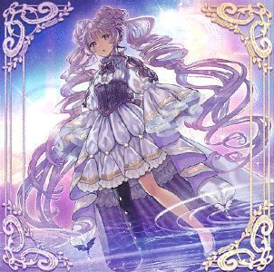

# ヴァルモニカ - モンスター

## 目次
- [ヴァルモニカ - モンスター](#ヴァルモニカ---モンスター)
  - [目次](#目次)
  - [ペンデュラムモンスター](#ペンデュラムモンスター)
    - [天使の聲](#天使の聲)
    - [悪魔の聲](#悪魔の聲)
  - [効果モンスター](#効果モンスター)
    - [天魔の聲選姫](#天魔の聲選姫)

## ペンデュラムモンスター

### 天使の聲

|属性|種族|レベル|ATK|DEF|その他|
|---|---|---|---|---|---|
|闇|天使|☆4|1200|2100|ペンデュラム|

|||
|---|---|
|**スケール**|◀︎3　3▶︎|

|ペンデュラム効果①||
|---|---|
|**種別**|-|
|**発動制限**|-|
|**制約**|-|
|**発動条件**|もう片方の自分のPゾーンに悪魔族モンスターカードが存在する場合|
|**コスト**|-|
|**対象**|-|
|**効果**|自分のLPが回復する度に、このカードに響鳴カウンターを１つ置く。|

|ペンデュラム効果②||
|---|---|
|**種別**|誘発効果・任意|
|**発動制限**|1ターンに1度|
|**制約**|-|
|**発動条件**|相手モンスターの攻撃宣言時|
|**コスト**|-|
|**対象**|-|
|**効果**|「ヴァルモニカ」Lモンスター１体のL召喚を行う。|

|モンスター効果①||
|---|---|
|**種別**|起動効果|
|**発動制限**|1ターンに1度(名称指定)|
|**制約**|-|
|**発動条件**|このカードが手札に存在する場合|
|**コスト**|手札から他のカード１枚を捨てる|
|**対象**|-|
|**効果**|デッキから「悪魔の聲」１体を選び、このカードとそのカードを自分のPゾーンに置く。|

|モンスター効果②||
|---|---|
|**種別**|起動効果|
|**発動制限**|1ターンに1度(名称指定)|
|**制約**|-|
|**発動条件**|このカードが召喚・特殊召喚したターンの自分メインフェイズ|
|**コスト**|自分の墓地から「ヴァルモニカ」通常魔法・通常罠カード１枚を除外する。|
|**対象**|-|
|**効果**|コストで除外した魔法・罠カード発動時の、LPを回復する方の効果を適用する。|

- 読み方は「アンジェロ・ヴァルモニカ」

---

### 悪魔の聲

|属性|種族|レベル|ATK|DEF|その他|
|---|---|---|---|---|---|
|光|悪魔|☆4|1200|2100|ペンデュラム|

|||
|---|---|
|**スケール**|◀︎5　5▶︎|

|ペンデュラム効果①||
|---|---|
|**種別**|-|
|**発動制限**|-|
|**制約**|-|
|**発動条件**|もう片方の自分のPゾーンに天使族モンスターカードが存在する場合|
|**コスト**|-|
|**対象**|-|
|**効果**|自分が効果ダメージを受ける度に、このカードに響鳴カウンターを１つ置く。|

|ペンデュラム効果②||
|---|---|
|**種別**|永続効果|
|**発動制限**|-|
|**制約**|-|
|**発動条件**|-|
|**コスト**|-|
|**対象**|-|
|**効果**|相手フィールドのモンスターの攻撃力は、 自分フィールドの響鳴カウンターの数×１００ダウンする。|

|モンスター効果①||
|---|---|
|**種別**|起動効果|
|**発動制限**|1ターンに1度(名称指定)|
|**制約**|-|
|**発動条件**|このカードが手札に存在する場合|
|**コスト**|手札から他のカード１枚を捨てる|
|**対象**|-|
|**効果**|デッキから「天使の聲」１体を選び、このカードとそのカードを自分のPゾーンに置く。|

|モンスター効果②||
|---|---|
|**種別**|起動効果|
|**発動制限**|1ターンに1度(名称指定)|
|**制約**|-|
|**発動条件**|このカードが召喚・特殊召喚したターンの自分メインフェイズ|
|**コスト**|自分の墓地から「ヴァルモニカ」通常魔法・通常罠カード１枚を除外する。|
|**対象**|-|
|**効果**|コストで除外した魔法・罠カード発動時の、ダメージを受ける方の効果を適用する。|

- 読み方は「デモーネ・ヴァルモニカ」

---

## 効果モンスター

### 天魔の聲選姫

|属性|種族|レベル|ATK|DEF|その他|
|---|---|---|---|---|---|
|水|魔法使い|☆4|1200|1200|-|

|効果①||
|---|---|
|**種別**|誘発効果|
|**発動制限**|1ターンに1度(名称指定)|
|**制約**|-|
|**発動条件**|召喚・P召喚に成功した場合|
|**コスト**|-|
|**対象**|-|
|**効果**|デッキから「天魔の聲選姫」以外の「ヴァルモニカ」カードをサーチする。|

|効果②||
|---|---|
|**種別**|永続効果|
|**発動制限**|-|
|**制約**|-|
|**発動条件**|-|
|**コスト**|-|
|**対象**|-|
|**効果**|自分フィールドに「天魔の聲選姫」以外のモンスターが存在する限り、 相手はこのカードを攻撃対象にできない。|

|効果③||
|---|---|
|**種別**|誘発効果|
|**発動制限**|1ターンに1度(名称指定)|
|**制約**|-|
|**発動条件**|**1.** このカードが墓地に送られた場合 **2.** 自分のPゾーンに「ヴァルモニカ」カードが2枚存在|
|**コスト**|-|
|**対象**|-|
|**効果**|このカードを手札に加える。|
