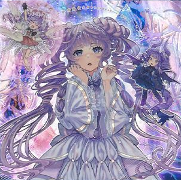

# ヴァルモニカ - 魔法・罠

## 目次
- [ヴァルモニカ - 魔法・罠](#ヴァルモニカ---魔法罠)
  - [目次](#目次)
  - [魔法カード](#魔法カード)
    - [ヴァルモニカ・シェルタ](#ヴァルモニカシェルタ)
    - [ヴァルモニカ・ディサルモニア](#ヴァルモニカディサルモニア)
    - [ヴァルモニカ・ヴェルサーレ](#ヴァルモニカヴェルサーレ)
    - [ヴァルモニカ・イントナーレ](#ヴァルモニカイントナーレ)
    - [ヴァルモニカ・インヴィターレ](#ヴァルモニカインヴィターレ)

## 魔法カード

### ヴァルモニカ・シェルタ

|種類|その他|
|---|---|
|通常魔法|-|

|||
|---|---|
|**カードの発動制限**|1ターンに1度(名称指定)|

|効果①||
|---|---|
|**種別**|-|
|**発動制限**|-|
|**制約**|自分のPゾーンに「ヴァルモニカ」カードが存在しない場合、 適用する効果は相手が選ぶ。|
|**発動条件**|-|
|**コスト**|-|
|**対象**|-|
|**効果**|効果①-👼、効果①-👿から１つを選んで適用する。|

|効果①-👼|※効果①から発動される|
|---|---|
|**種別**|-|
|**発動制限**|-|
|**制約**|-|
|**発動条件**|-|
|**コスト**|-|
|**対象**|-|
|**効果**|**1.** 自分は500LP回復する。 **2.** 自分の手札を1枚選んでデッキの一番下に戻すことができる。 **3.** 2を適用した場合、2枚ドローする。|

|効果①-👿|※効果①から発動される|
|---|---|
|**種別**|-|
|**発動制限**|-|
|**制約**|-|
|**発動条件**|-|
|**コスト**|-|
|**対象**|-|
|**効果**|**1.** 自分は500ダメージを受ける。 **2.** デッキから「ヴァルモニカ・シェルタ」以外の 「ヴァルモニカ」魔法・罠カード１枚を手札に加える事ができる。|

---

### ヴァルモニカ・ディサルモニア

|種類|その他|
|---|---|
|通常魔法|-|

|||
|---|---|
|**カードの発動制限**|1ターンに1度(名称指定)|

|効果①||
|---|---|
|**種別**|-|
|**発動制限**|-|
|**制約**|-|
|**発動条件**|-|
|**コスト**|-|
|**対象**|-|
|**効果**|**1.** 響鳴カウンターを置く事ができる自分のPゾーンのカード１枚に 響鳴カウンターを１つ置く。 **2.** 効果①-👼、効果①-👿から１つを選んで適用する。|

|効果①-👼|※効果①から発動される|
|---|---|
|**種別**|-|
|**発動制限**|-|
|**制約**|-|
|**発動条件**|-|
|**コスト**|-|
|**対象**|-|
|**効果**|**1.** 自分は500LP回復する。 **2.** 「ヴァルモニカ・ディサルモニア」以外の自分の除外状態の 「ヴァルモニカ」カード１枚を手札に加える事ができる。|

|効果①-👿|※効果①から発動される|
|---|---|
|**種別**|-|
|**発動制限**|-|
|**制約**|-|
|**発動条件**|-|
|**コスト**|-|
|**対象**|-|
|**効果**|**1.** 自分は500ダメージを受ける。 **2.** 「ヴァルモニカ・ディサルモニア」以外の自分の墓地の 「ヴァルモニカ」カード１枚を手札に加える事ができる。|

#### memo
- 発動するだけで響鳴カウンターが1つ乗る。やばい。
  - カード発動時の効果なので、「天使の聲」や「悪魔の聲」の効果で効果をコピーしても 響鳴カウンターを乗せられない。
  - 「ヴァルモニカの神異－ゼブフェーラ」の効果②であれば可能。
- 他の通常魔法と違い、自分のPゾーンに「ヴァルモニカ」カードが存在しなくても 適用する効果を自分で選べる。

---

### ヴァルモニカ・ヴェルサーレ

|種類|その他|
|---|---|
|通常魔法|-|

|||
|---|---|
|**カードの発動制限**|1ターンに1度(名称指定)|

|効果①||
|---|---|
|**種別**|-|
|**発動制限**|-|
|**制約**|自分のPゾーンに「ヴァルモニカ」カードが存在しない場合、 適用する効果は相手が選ぶ。|
|**発動条件**|-|
|**コスト**|-|
|**対象**|-|
|**効果**|効果①-👼、効果①-👿から１つを選んで適用する。|

|効果①-👼|※効果①から発動される|
|---|---|
|**種別**|-|
|**発動制限**|-|
|**制約**|-|
|**発動条件**|-|
|**コスト**|-|
|**対象**|-|
|**効果**|**1.** 自分は500LP回復する。 **2.** 「ヴァルモニカ」カードが出るまで自分のデッキの上から カードをめくる事ができる。 **3.** 2を適用した場合、めくった「ヴァルモニカ」カードを手札に加え、 残りをデッキに戻す。|

|効果①-👿|※効果①から発動される|
|---|---|
|**種別**|-|
|**発動制限**|-|
|**制約**|-|
|**発動条件**|-|
|**コスト**|-|
|**対象**|-|
|**効果**|**1.** 自分は500ダメージを受ける。 **2.** デッキから「ヴァルモニカ・ヴェルサーレ」以外の 「ヴァルモニカ」カード１枚を墓地へ送る事ができる。|

---

### ヴァルモニカ・イントナーレ

|種類|その他|
|---|---|
|通常魔法|-|

|||
|---|---|
|**カードの発動制限**|1ターンに1度(名称指定)|

|効果①||
|---|---|
|**種別**|-|
|**発動制限**|-|
|**制約**|自分のPゾーンに「ヴァルモニカ」カードが存在しない場合、 適用する効果は相手が選ぶ。|
|**発動条件**|-|
|**コスト**|-|
|**対象**|-|
|**効果**|効果①-👼、効果①-👿から１つを選んで適用する。|

|効果①-👼|※効果①から発動される|
|---|---|
|**種別**|-|
|**発動制限**|-|
|**制約**|-|
|**発動条件**|-|
|**コスト**|-|
|**対象**|-|
|**効果**|**1.** 自分は500LP回復する。 **2.** 特殊召喚可能なモンスターが自分の墓地に存在する場合、 その内の1体を相手が選び、そのモンスターを自分フィールドに特殊召喚する。|

|効果①-👿|※効果①から発動される|
|---|---|
|**種別**|-|
|**発動制限**|-|
|**制約**|-|
|**発動条件**|-|
|**コスト**|-|
|**対象**|-|
|**効果**|**1.** 自分は500ダメージを受ける。 **2.** 自分の墓地からレベル４モンスター1体を手札に加えることができる。|

---

### ヴァルモニカ・インヴィターレ

|種類|その他|
|---|---|
|速攻魔法|-|

|||
|---|---|
|**カードの発動制限**|1ターンに1度(名称指定)|

|効果①||
|---|---|
|**種別**|-|
|**発動制限**|-|
|**制約**|-|
|**発動条件**|-|
|**コスト**|-|
|**対象**|-|
|**効果**|効果①-1、効果①-2から１つを選んで適用する。|

|効果①-1|※効果①から発動される|
|---|---|
|**種別**|-|
|**発動制限**|-|
|**制約**|発動後、ターン終了時まで「ヴァルモニカ」モンスター以外の フィールドのモンスターの効果を発動できない。|
|**発動条件**|-|
|**コスト**|-|
|**対象**|-|
|**効果**|デッキから「ヴァルモニカ」モンスター1体を特殊召喚する。|

|効果①-2|※効果①から発動される|
|---|---|
|**種別**|-|
|**発動制限**|-|
|**制約**|-|
|**発動条件**|自分フィールドにPモンスター以外の「ヴァルモニカ」モンスターが存在する場合|
|**コスト**|-|
|**対象**|-|
|**効果**|**1.** デッキからカード名が異なる「ヴァルモニカ」Pモンスターを２体を選ぶ。 **2.** その内の１体を手札に加え、もう１体をEXデッキに表側で加える。|

---

