# ヴェンデット - モンスター

## 目次

- [ヴェンデット - モンスター](#ヴェンデット---モンスター)
  - [目次](#目次)
  - [効果モンスター](#効果モンスター)
    - [ヴェンデット・アニマ](#ヴェンデットアニマ)
    - [ヴェンデット・コア](#ヴェンデットコア)
    - [ヴェンデット・ストリゲス](#ヴェンデットストリゲス)
    - [ヴェンデット・ヘルハウンド](#ヴェンデットヘルハウンド)
    - [ヴェンデット・レヴナント](#ヴェンデットレヴナント)
    - [スカー・ヴェンデット](#スカーヴェンデット)
  - [儀式モンスター](#儀式モンスター)
    - [ヴェンデット・キマイラ](#ヴェンデットキマイラ)
    - [リヴェンデット・スレイヤー](#リヴェンデットスレイヤー)
    - [ヴェンデット・バスタード](#ヴェンデットバスタード)
    - [リヴェンデット・エグゼクター](#リヴェンデットエグゼクター)
    - [ヴェンデット・スカヴェンジャー](#ヴェンデットスカヴェンジャー)
  - [リンクモンスター](#リンクモンスター)
    - [アドヴェンデット・セイヴァー](#アドヴェンデットセイヴァー)


## 効果モンスター

### ヴェンデット・アニマ

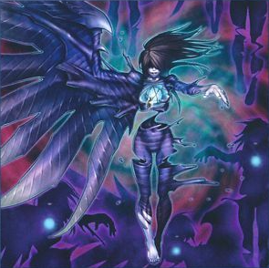

|属性|種族|レベル|ATK|DEF|その他|
|---|---|---|---|---|---|
|<font color="purple">闇</font>|アンデット|☆1|0|0|-|

```
このカード名の①②の効果はそれぞれ１ターンに１度しか使用できない。
①：墓地のこのカードを除外し、「ヴェンデット・アニマ」以外の除外されている自分の「ヴェンデット」モンスター１体を対象として発動できる。
そのモンスターを特殊召喚する。この効果の発動後、ターン終了時まで自分はアンデット族モンスターしか特殊召喚できない。
②：フィールドのこのカードを使用して儀式召喚した「ヴェンデット」モンスターは以下の効果を得る。
●このカードが戦闘で破壊したモンスターは墓地へは行かず除外される。
```

|効果①||
|---|---|
|**種別**|起動効果|
|**発動回数**|1ターンに1度(<font color="red">名称指定</font>)|
|**制約**|発動後、ターン終了時まで自分はアンデット族モンスターしか特殊召喚できない。|
|**発動条件**|-|
|**コスト**|墓地のこのカードを除外|
|**対象**|「ヴェンデット・アニマ」以外の除外されている自分の「ヴェンデット」モンスター１体|
|**効果**|対象のモンスターを特殊召喚する。|

|効果②||
|---|---|
|**種別**|誘発効果・強制|
|**発動回数**|1ターンに1度(<font color="red">名称指定</font>)|
|**制約**|-|
|**発動条件**|-|
|**コスト**|-|
|**対象**|-|
|**効果**|<font color="red">フィールドの</font>このカードを使用して儀式召喚した「ヴェンデット」モンスターに効果②-1を付与する|

|効果②-1|※効果②によって儀式モンスターに付与される|
|---|---|
|**種別**|永続効果|
|**発動回数**|-|
|**制約**|-|
|**発動条件**|-|
|**コスト**|-|
|**対象**|-|
|**効果**|このカードが戦闘で破壊したモンスターは墓地へは行かず除外される。|

---

### ヴェンデット・コア

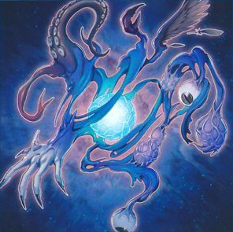

|属性|種族|レベル|ATK|DEF|その他|
|---|---|---|---|---|---|
|<font color="purple">闇</font>|アンデット|☆1|0|500|-|

```
このカード名の①②の効果はそれぞれ１ターンに１度しか使用できない。
①：このカードが墓地に存在する場合、自分の墓地からこのカード以外のアンデット族モンスター１体を除外して発動できる。
このカードを特殊召喚する。この効果で特殊召喚したこのカードは、フィールドから離れた場合に除外される。
②：フィールドのこのカードを使用して儀式召喚した「ヴェンデット」モンスターは以下の効果を得る。
●このカードは相手の効果の対象にならない。
```

|効果①||
|---|---|
|**種別**|起動効果|
|**発動回数**|1ターンに1度(<font color="red">名称指定</font>)|
|**制約**|この効果で特殊召喚したこのカードは、フィールドから離れた場合に除外される。|
|**発動条件**|このカードが墓地に存在する場合|
|**コスト**|自分の墓地からこのカード以外のアンデット族モンスター１体を除外|
|**対象**|-|
|**効果**|このカードを墓地から特殊召喚|

|効果②||
|---|---|
|**種別**|誘発効果・強制|
|**発動回数**|1ターンに1度(<font color="red">名称指定</font>)|
|**制約**|-|
|**発動条件**|-|
|**コスト**|-|
|**対象**|-|
|**効果**|<font color="red">フィールドの</font>このカードを使用して儀式召喚した「ヴェンデット」モンスターに効果②-1を付与する|

|効果②-1|※効果②によって儀式モンスターに付与される|
|---|---|
|**種別**|永続効果|
|**発動回数**|-|
|**制約**|-|
|**発動条件**|-|
|**コスト**|-|
|**対象**|-|
|**効果**|このカードは相手の効果の対象にならない。|

---

### ヴェンデット・ストリゲス

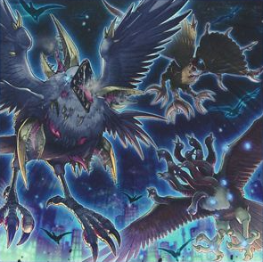

|属性|種族|レベル|ATK|DEF|その他|
|---|---|---|---|---|---|
|<font color="purple">闇</font>|アンデット|☆2|500|2000|-|

```
このカード名の①②の効果はそれぞれ１ターンに１度しか使用できない。
①：このカードが墓地へ送られた場合、手札の「ヴェンデット」カード１枚を相手に見せて発動できる。
このカードを特殊召喚する。この効果で特殊召喚したこのカードは、フィールドから離れた場合に除外される。
②：フィールドのこのカードを使用して儀式召喚した「ヴェンデット」モンスターは以下の効果を得る。
●このカードが相手モンスターと戦闘を行ったダメージ計算後に発動できる。自分はデッキから１枚ドローし、その後手札を１枚選んで捨てる。
```

|効果①||
|---|---|
|**種別**|誘発効果・任意|
|**発動回数**|1ターンに1度(<font color="red">名称指定</font>)|
|**制約**|この効果で特殊召喚したこのカードは、フィールドから離れた場合に除外される。|
|**発動条件**|このカードが墓地へ送られた場合|
|**コスト**|手札の「ヴェンデット」カード１枚を相手に見せる|
|**対象**|-|
|**効果**|このカードを墓地から特殊召喚|

|効果②||
|---|---|
|**種別**|誘発効果・強制|
|**発動回数**|1ターンに1度(<font color="red">名称指定</font>)|
|**制約**|-|
|**発動条件**|-|
|**コスト**|-|
|**対象**|-|
|**効果**|<font color="red">フィールドの</font>このカードを使用して儀式召喚した「ヴェンデット」モンスターに効果②-1を付与する|

|効果②-1|※効果②によって儀式モンスターに付与される|
|---|---|
|**種別**|誘発効果・任意|
|**発動回数**|1ターンに1度|
|**制約**|-|
|**発動条件**|このカードが相手モンスターと戦闘を行ったダメージ計算後|
|**コスト**|-|
|**対象**|-|
|**効果**|自分はデッキから１枚ドローし、その後手札を１枚選んで捨てる。|

---

### ヴェンデット・ヘルハウンド

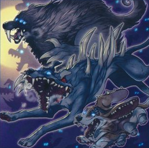

|属性|種族|レベル|ATK|DEF|その他|
|---|---|---|---|---|---|
|<font color="purple">闇</font>|アンデット|☆3|0|2100|-|

```
このカード名の①②の効果はそれぞれ１ターンに１度しか使用できない。
①：このカードが墓地に存在する場合、手札から「ヴェンデット」カード１枚を捨てて発動できる。
このカードを特殊召喚する。この効果で特殊召喚したこのカードは、フィールドから離れた場合に除外される。
②：フィールドのこのカードを使用して儀式召喚した「ヴェンデット」モンスターは以下の効果を得る。
●１ターンに１度、相手フィールドの魔法・罠カード１枚を対象として発動できる。
そのカードを除外する。この効果は相手ターンでも発動できる。
```

|効果①||
|---|---|
|**種別**|誘発効果・任意|
|**発動回数**|1ターンに1度(<font color="red">名称指定</font>)|
|**制約**|この効果で特殊召喚したこのカードは、フィールドから離れた場合に除外される。|
|**発動条件**|このカードが墓地に存在する場合|
|**コスト**|手札から「ヴェンデット」カード１枚を捨てる|
|**対象**|-|
|**効果**|このカードを墓地から特殊召喚する|

|効果②||
|---|---|
|**種別**|誘発効果・強制|
|**発動回数**|1ターンに1度(<font color="red">名称指定</font>)|
|**制約**|-|
|**発動条件**|-|
|**コスト**|-|
|**対象**|-|
|**効果**|<font color="red">フィールドの</font>このカードを使用して儀式召喚した「ヴェンデット」モンスターに効果②-1を付与する|

|効果②-1|※効果②によって儀式モンスターに付与される|
|---|---|
|**種別**|誘発即時効果|
|**発動回数**|1ターンに1度|
|**制約**|-|
|**発動条件**|-|
|**コスト**|-|
|**対象**|相手フィールドの魔法・罠カード１枚|
|**効果**|対象のカードを除外する|

---

### ヴェンデット・レヴナント


|属性|種族|レベル|ATK|DEF|その他|
|---|---|---|---|---|---|
|<font color="purple">闇</font>|アンデット|☆4|1800|200|-|

```
このカード名の②の効果は１ターンに１度しか使用できない。
①：このカードが相手によって破壊され墓地へ送られた場合に発動できる。このカードを特殊召喚する。
この効果で特殊召喚したこのカードは、フィールドから離れた場合に除外される。
②：フィールドのこのカードを使用して儀式召喚した「ヴェンデット」モンスターは以下の効果を得る。
●１ターンに１度、相手フィールドの特殊召喚されたモンスター１体を対象として発動できる。
そのモンスターを除外する。この効果は相手ターンでも発動できる。
```

|効果①||
|---|---|
|**種別**|誘発効果・任意|
|**発動回数**|-|
|**制約**|この効果で特殊召喚したこのカードは、フィールドから離れた場合に除外される。|
|**発動条件**|このカードが相手によって破壊され墓地へ送られた場合|
|**コスト**|-|
|**対象**|-|
|**効果**|このカードを墓地から特殊召喚する|

|効果②||
|---|---|
|**種別**|誘発効果・強制|
|**発動回数**|1ターンに1度(<font color="red">名称指定</font>)|
|**制約**|-|
|**発動条件**|-|
|**コスト**|-|
|**対象**|-|
|**効果**|<font color="red">フィールドの</font>このカードを使用して儀式召喚した「ヴェンデット」モンスターに効果②-1を付与する|

|効果②-1|※効果②によって儀式モンスターに付与される|
|---|---|
|**種別**|誘発即時効果|
|**発動回数**|1ターンに1度|
|**制約**|-|
|**発動条件**|-|
|**コスト**|-|
|**対象**|相手フィールドの特殊召喚されたモンスター１体|
|**効果**|対象のモンスターを除外する|

---

### スカー・ヴェンデット

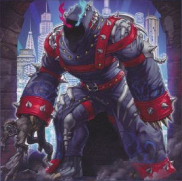

|属性|種族|レベル|ATK|DEF|その他|
|---|---|---|---|---|---|
|<font color="purple">闇</font>|アンデット|☆6|2300|0|-|

```
このカード名の①②の効果はそれぞれ１ターンに１度しか使用できない。
①：このカードが墓地へ送られた場合に発動できる。デッキから「ヴェンデット」魔法・罠カード１枚を手札に加える。
②：このカードが墓地に存在する状態で、フィールドのモンスターがリリースされた場合、
自分の墓地からこのカード以外のアンデット族モンスター１体を除外して発動できる。このカードを特殊召喚する。
この効果で特殊召喚したこのカードがモンスターゾーンに表側表示で存在する限り、自分は「ヴェンデット」モンスターしか特殊召喚できない。
```

|効果①||
|---|---|
|**種別**|誘発効果・任意|
|**発動回数**|1ターンに1度(<font color="red">名称指定</font>)|
|**制約**|-|
|**発動条件**|このカードが墓地へ送られた場合|
|**コスト**|-|
|**対象**|-|
|**効果**|デッキから「ヴェンデット」魔法・罠カード１枚を手札に加える。|

|効果②||
|---|---|
|**種別**|誘発効果・任意|
|**発動回数**|1ターンに1度(<font color="red">名称指定</font>)|
|**制約**|この効果で特殊召喚したこのカードがモンスターゾーンに表側表示で存在する限り、<br>自分は「ヴェンデット」モンスターしか特殊召喚できない。|
|**発動条件**|このカードが墓地に存在する状態で、フィールドのモンスターがリリースされた場合|
|**コスト**|自分の墓地からこのカード以外のアンデット族モンスター１体を除外|
|**対象**|-|
|**効果**|このカードを墓地から特殊召喚する|

## 儀式モンスター

### ヴェンデット・キマイラ

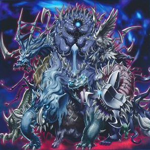

|属性|種族|レベル|ATK|DEF|その他|
|---|---|---|---|---|---|
|<font color="purple">闇</font>|アンデット|☆5|2300|0|**儀式**|

```
「ヴェンデット」儀式魔法カードにより降臨。このカード名の①②の効果はそれぞれ１ターンに１度しか使用できない。
①：フィールドのカードを破壊する魔法・罠・モンスターの効果が発動した時、
自分の墓地からアンデット族モンスター１体を除外して発動できる。その発動を無効にし破壊する。
②：このカードが儀式召喚のために、リリースまたは除外された場合に発動する。
相手フィールドの全てのモンスターの攻撃力・守備力は５００ダウンする。
```

|効果①||
|---|---|
|**種別**|誘発即時効果|
|**発動回数**|1ターンに1度(<font color="red">名称指定</font>)|
|**制約**|-|
|**発動条件**|フィールドのカードを破壊する魔法・罠・モンスターの効果が発動した時|
|**コスト**|自分の墓地からアンデット族モンスター１体を除外|
|**対象**|-|
|**効果**|その効果の発動を無効にし破壊する|

|効果②||
|---|---|
|**種別**|誘発効果・強制|
|**発動回数**|1ターンに1度(<font color="red">名称指定</font>)|
|**制約**|-|
|**発動条件**|このカードが儀式召喚のために、リリースまたは除外された場合|
|**コスト**|-|
|**対象**|-|
|**効果**|相手フィールドの全てのモンスターの攻撃力・守備力は５００ダウンする。|

---

### リヴェンデット・スレイヤー

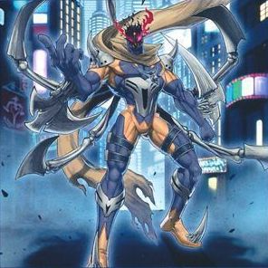

|属性|種族|レベル|ATK|DEF|その他|
|---|---|---|---|---|---|
|<font color="purple">闇</font>|アンデット|☆6|2400|0|**儀式**|

```
「ヴェンデット」儀式魔法カードにより降臨。このカード名の②の効果は１ターンに１度しか使用できない。
①：このカードが相手モンスターと戦闘を行うダメージ計算時に１度、自分の墓地からアンデット族モンスター１体を除外して発動できる。
このカードの攻撃力は３００アップする。
②：儀式召喚したこのカードが墓地へ送られた場合に発動できる。デッキから儀式魔法カード１枚を手札に加え、
デッキから「ヴェンデット」モンスター１体を墓地へ送る。
```

|効果①||
|---|---|
|**種別**|誘発効果・任意|
|**発動回数**|ダメージ計算ごとに1度|
|**制約**|-|
|**発動条件**|このカードが相手モンスターと戦闘を行うダメージ計算時|
|**コスト**|自分の墓地からアンデット族モンスター１体を除外|
|**対象**|-|
|**効果**|このカードの攻撃力は３００アップする。|

|効果②||
|---|---|
|**種別**|誘発効果・任意|
|**発動回数**|1ターンに1度(<font color="red">名称指定</font>)|
|**制約**|-|
|**発動条件**|<font color="red">儀式召喚した</font>このカードが墓地へ送られた場合|
|**コスト**|-|
|**対象**|-|
|**効果**|1. デッキから儀式魔法カード１枚を手札に加える。<br>2. デッキから「ヴェンデット」モンスター１体を墓地へ送る。|

---

### ヴェンデット・バスタード

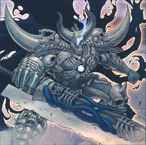

|属性|種族|レベル|ATK|DEF|その他|
|---|---|---|---|---|---|
|<font color="purple">闇</font>|アンデット|☆7|2700|0|**儀式**|

```
「ヴェンデット」儀式魔法カードにより降臨。このカード名の①②の効果はそれぞれ１ターンに１度しか使用できない。
①：自分の墓地から「ヴェンデット」カード１枚を除外し、カードの種類（モンスター・魔法・罠）を宣言して発動できる。
このターン、相手は宣言した種類のカードの効果を発動できない。②：儀式召喚したこのカードが墓地へ送られた場合に発動できる。デッキから儀式モンスター１体を手札に加え、
デッキから「ヴェンデット」モンスター１体を墓地へ送る。
```

|効果①||
|---|---|
|**種別**|起動効果|
|**発動回数**|1ターンに1度(<font color="red">名称指定</font>)|
|**制約**|-|
|**発動条件**|-|
|**コスト**|1. 自分の墓地から「ヴェンデット」カード１枚を除外<br>2. カードの種類（モンスター・魔法・罠）を宣言|
|**対象**|-|
|**効果**|このターン、相手は宣言した種類のカードの効果を発動できない。|

|効果②||
|---|---|
|**種別**|誘発効果・任意|
|**発動回数**|1ターンに1度(<font color="red">名称指定</font>)|
|**制約**|-|
|**発動条件**|<font color="red">儀式召喚した</font>このカードが墓地へ送られた場合|
|**コスト**|-|
|**対象**|-|
|**効果**|1. デッキから儀式モンスター１体を手札に加える。<br>2. デッキから「ヴェンデット」モンスター１体を墓地へ送る。|

---

### リヴェンデット・エグゼクター

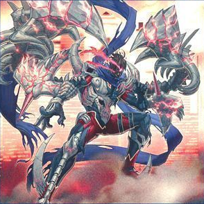

|属性|種族|レベル|ATK|DEF|その他|
|---|---|---|---|---|---|
|<font color="purple">闇</font>|アンデット|☆8|3000|0|**儀式**|

```
「ヴェンデット」儀式魔法カードにより降臨。このカード名の③の効果は１ターンに１度しか使用できない。
①：このカードはモンスターゾーンに存在する限り、カード名を「リヴェンデット・スレイヤー」として扱う。
②：儀式召喚したこのカードがモンスターゾーンに存在する限り、自分フィールドの他のカードを相手は効果の対象にできない。
③：儀式召喚したこのカードが戦闘または相手の効果で破壊された場合に発動できる。デッキから「ヴェンデット」カード１枚を手札に加える。
```

|効果①||
|---|---|
|**種別**|永続効果|
|**発動回数**|-|
|**制約**|-|
|**発動条件**|-|
|**コスト**|-|
|**対象**|-|
|**効果**|このカードはモンスターゾーンに存在する限り、カード名を「リヴェンデット・スレイヤー」として扱う。|

|効果②||
|---|---|
|**種別**|永続効果|
|**発動回数**|-|
|**制約**|-|
|**発動条件**|-|
|**コスト**|-|
|**対象**|-|
|**効果**|儀式召喚したこのカードがモンスターゾーンに存在する限り、<br>自分フィールドの他のカードを相手は効果の対象にできない。|

|効果③||
|---|---|
|**種別**|誘発効果・任意|
|**発動回数**|1ターンに1度(<font color="red">名称指定</font>)|
|**制約**|-|
|**発動条件**|<font color="red">儀式召喚した</font>このカードが戦闘または相手の効果で破壊された場合|
|**コスト**|-|
|**対象**|-|
|**効果**|デッキから「ヴェンデット」カード１枚を手札に加える。|

---

### ヴェンデット・スカヴェンジャー

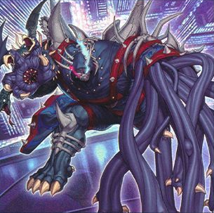

|属性|種族|レベル|ATK|DEF|その他|
|---|---|---|---|---|---|
|<font color="purple">闇</font>|アンデット|☆8|2800|0|**儀式**|

```
「ヴェンデット」儀式魔法カードにより降臨。このカード名の①②の効果はそれぞれ１ターンに１度しか使用できない。
①：お互いのメインフェイズに、自分フィールドのアンデット族モンスター１体をリリースして発動できる。
このカードの攻撃力はターン終了時まで、リリースしたモンスターの元々の攻撃力分アップする。
②：このカードが墓地に存在し、自分フィールドに「リヴェンデット・スレイヤー」が存在する場合に発動できる。
このカードを特殊召喚する。この効果で特殊召喚したこのカードは、フィールドから離れた場合に除外される。
```

|効果①||
|---|---|
|**種別**|誘発即時効果|
|**発動回数**|1ターンに1度(<font color="red">名称指定</font>)|
|**制約**|-|
|**発動条件**|お互いのメインフェイズ|
|**コスト**|自分フィールドのアンデット族モンスター１体をリリース|
|**対象**|-|
|**効果**|このカードの攻撃力はターン終了時まで、リリースしたモンスターの元々の攻撃力分アップする。|

|効果②||
|---|---|
|**種別**|起動効果|
|**発動回数**|1ターンに1度(<font color="red">名称指定</font>)|
|**制約**|この効果で特殊召喚したこのカードは、フィールドから離れた場合に除外される。|
|**発動条件**|このカードが墓地に存在し、自分フィールドに「リヴェンデット・スレイヤー」が存在する場合|
|**コスト**|-|
|**対象**|-|
|**効果**|このカードを墓地から特殊召喚する。|

## リンクモンスター

### アドヴェンデット・セイヴァー

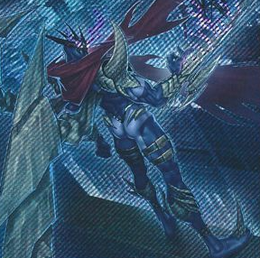

|属性|種族|リンク|ATK|DEF|マーカー|
|---|---|---|---|---|---|
|<font color="purple">闇</font>|アンデット|2|1600|-|↖︎ ↑ ↗︎<br>← • →<br><font color="red">↙︎</font> ↓ <font color="red">↘︎</font>|

```
アンデット族モンスター２体
このカード名の②③の効果はそれぞれ１ターンに１度しか使用できない。
①：このカードはモンスターゾーンに存在する限り、カード名を「リヴェンデット・スレイヤー」として扱う。
②：自分の墓地の「ヴェンデット」カード１枚を対象として発動できる。そのカードを手札に加える。
③：このカードが相手モンスターと戦闘を行うダメージ計算時、デッキからアンデット族モンスター１体を墓地へ送って発動できる。
その相手モンスターの攻撃力はターン終了時まで、墓地へ送ったモンスターのレベル×２００ダウンする。
```

|効果①||
|---|---|
|**種別**|永続効果|
|**発動回数**|-|
|**制約**|-|
|**発動条件**|-|
|**コスト**|-|
|**対象**|-|
|**効果**|このカードはモンスターゾーンに存在する限り、カード名を「リヴェンデット・スレイヤー」として扱う。|

|効果②||
|---|---|
|**種別**|起動効果|
|**発動回数**|1ターンに1度(<font color="red">名称指定</font>)|
|**制約**|-|
|**発動条件**|-|
|**コスト**|-|
|**対象**|自分の墓地の「ヴェンデット」カード１枚|
|**効果**|対象のカードを手札に加える。|

|効果③||
|---|---|
|**種別**|誘発効果・任意|
|**発動回数**|1ターンに1度(<font color="red">名称指定</font>)|
|**制約**|-|
|**発動条件**|このカードが相手モンスターと戦闘を行うダメージ計算時|
|**コスト**|デッキからアンデット族モンスター１体を墓地へ送る|
|**対象**|-|
|**効果**|その相手モンスターの攻撃力はターン終了時まで、墓地へ送ったモンスターのレベル×２００ダウンする。|
