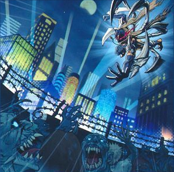

# ヴェンデット - 魔法・罠

## 目次
- [ヴェンデット - 魔法・罠](#ヴェンデット---魔法罠)
  - [目次](#目次)
  - [魔法カード](#魔法カード)
    - [リヴェンデット・ボーン](#リヴェンデットボーン)
    - [リヴェンデット・バース](#リヴェンデットバース)
    - [ラヴェナス・ヴェンデット](#ラヴェナスヴェンデット)
    - [ヴェンデット・ナイトメア](#ヴェンデットナイトメア)
    - [ヴェンデット・ナイト](#ヴェンデットナイト)
    - [ヴェンデット・チャージ](#ヴェンデットチャージ)
  - [罠カード](#罠カード)
    - [ヴェンデット・リバース](#ヴェンデットリバース)
    - [ヴェンデット・リボーン](#ヴェンデットリボーン)
    - [ヴェンデット・リユニオン](#ヴェンデットリユニオン)
    - [ヴェンデット・デイブレイク](#ヴェンデットデイブレイク)

## 魔法カード

### リヴェンデット・ボーン

|種類|その他|
|---|---|
|儀式魔法|-|

|||
|---|---|
|**カードの発動制限**|-|

|効果①||
|---|---|
|**種別**|-|
|**発動制限**|-|
|**制約**|-|
|**発動条件**|-|
|**コスト**|-|
|**対象**|-|
|**効果**|手札・墓地から「ヴェンデット」儀式モンスター１体を儀式召喚する。 レベルの合計が儀式召喚するモンスターのレベル以上になるよう、儀式素材を以下a,bの方法で準備する。 　**a.** 自分の手札・フィールドのモンスターをリリースする。 　**b.** 自分の墓地のアンデット族モンスターを除外する。|

|効果②||
|---|---|
|**種別**|誘発効果・任意|
|**発動制限**|-|
|**制約**|-|
|**発動条件**|自分フィールドの「リヴェンデット・スレイヤー」が戦闘・効果で破壊される場合|
|**コスト**|-|
|**対象**|-|
|**効果**|「リヴェンデット・スレイヤー」が破壊される代わりに墓地のこのカードを除外できる。|

- 効果②は複数体の「リヴェンデット・スレイヤー」が同時に破壊される場合でも守れる。

---

### リヴェンデット・バース

|種類|その他|
|---|---|
|儀式魔法|-|

|||
|---|---|
|**カードの発動制限**|1ターンに1度(名称指定)|

|効果①||
|---|---|
|**種別**|-|
|**発動制限**|-|
|**制約**|この効果で儀式召喚したモンスターは、次のターンのエンドフェイズに破壊される。|
|**発動条件**|-|
|**コスト**|-|
|**対象**|-|
|**効果**|手札・墓地から「ヴェンデット」儀式モンスター１体を儀式召喚する。 レベルの合計が儀式召喚するモンスターと同じになるよう、儀式素材を以下a,bの方法で準備する。 　**a.** 自分の手札・フィールドのモンスターをリリースする。 　**b.** デッキから「ヴェンデット」モンスター（１体まで）を墓地へ送る。|

---

### ラヴェナス・ヴェンデット

|種類|その他|
|---|---|
|儀式魔法|-|

|||
|---|---|
|**カードの発動制限**|1ターンに1度(名称指定)|

|効果①||
|---|---|
|**種別**|-|
|**発動制限**|-|
|**制約**|-|
|**発動条件**|-|
|**コスト**|-|
|**対象**|-|
|**効果**|**1.** 自分の手札・デッキ・墓地から「ヴェンデット・スカヴェンジャー」以外の「ヴェンデット」モンスター１体を選んで裏側守備表示で特殊召喚する。  **2.** 手札・墓地から「ヴェンデット」儀式モンスター１体を儀式召喚する。 レベルの合計が儀式召喚するモンスターのレベル以上になるよう、儀式素材を以下aの方法で準備する。 　**a.** 1で特殊召喚したモンスターを含む自分フィールドのモンスターをリリースする。|

---

### ヴェンデット・ナイトメア

|種類|その他|
|---|---|
|永続魔法|-|

|||
|---|---|
|**カードの発動制限**|-|

|効果①||
|---|---|
|**種別**|起動効果|
|**発動制限**|1ターンに1度|
|**制約**|-|
|**発動条件**|-|
|**コスト**|自分の手札・フィールドから「ヴェンデット」モンスターを任意の数だけリリースする。|
|**対象**|自分フィールドの表側表示モンスター１体|
|**効果**|対象のモンスターのレベルはターン終了時までリリースしたモンスターの数だけ上がる。|

|効果②||
|---|---|
|**種別**|誘発効果・任意|
|**発動制限**|1ターンに1度(名称指定)|
|**制約**|-|
|**発動条件**|自分の「ヴェンデット」儀式モンスターの攻撃で相手モンスターを破壊した時|
|**コスト**|-|
|**対象**|-|
|**効果**|その自分の「ヴェンデット」儀式モンスターの攻撃力は１０００アップする。|

---

### ヴェンデット・ナイト

|種類|その他|
|---|---|
|フィールド魔法|-|

|||
|---|---|
|**カードの発動制限**|-|

|効果①||
|---|---|
|**種別**|起動効果|
|**発動制限**|1ターンに1度(名称指定)|
|**制約**|-|
|**発動条件**|-|
|**コスト**|手札を１枚捨てる。|
|**対象**|-|
|**効果**|デッキから「ヴェンデット」モンスター１体を手札に加える。|

|効果②||
|---|---|
|**種別**|誘発効果・任意|
|**発動制限**|-|
|**制約**|-|
|**発動条件**|自分の「ヴェンデット」モンスターの攻撃で相手モンスターを破壊した時|
|**コスト**|自分の墓地から「ヴェンデット」モンスター１体を除外する。|
|**対象**|-|
|**効果**|その「ヴェンデット」モンスターは相手モンスターに続けて攻撃できる。|

---

### ヴェンデット・チャージ

|種類|その他|
|---|---|
|速攻魔法|-|

|||
|---|---|
|**カードの発動制限**|1ターンに1度(名称指定)|

|効果①||
|---|---|
|**種別**|-|
|**発動制限**|-|
|**制約**|-|
|**発動条件**|-|
|**コスト**|手札及び自分フィールドの表側表示モンスターの中から、 アンデット族モンスター１体を墓地へ送る。|
|**対象**|-|
|**効果**|デッキから「ヴェンデット」モンスター１体を特殊召喚する。|

---

## 罠カード

### ヴェンデット・リバース

|種類|その他|
|---|---|
|通常罠|-|

|||
|---|---|
|**カードの発動制限**|-|

|効果①||
|---|---|
|**種別**|-|
|**発動制限**|1ターンに1度(名称指定)|
|**制約**|-|
|**発動条件**|-|
|**コスト**|手札を１枚捨てる。|
|**対象**|**ⅰ.** 自分の墓地の「ヴェンデット」モンスター１体 **ⅱ.** 自分の墓地の儀式魔法カード１枚|
|**効果**|**1.** 対象ⅰのモンスターを守備表示で特殊召喚する。 **2.** 対象ⅱの儀式魔法カードを手札に加える。|

|効果②||
|---|---|
|**種別**|-|
|**発動制限**|1ターンに1度(名称指定)|
|**制約**|-|
|**発動条件**|-|
|**コスト**|墓地のこのカードを除外する。|
|**対象**|除外されている自分のアンデット族モンスター５体|
|**効果**|**1.** 対象のモンスターをデッキに加えてシャッフルする。 **2.** 自分はデッキから１枚ドローする。|

---

### ヴェンデット・リボーン

|種類|その他|
|---|---|
|通常罠|-|

|||
|---|---|
|**カードの発動制限**|-|

|効果①||
|---|---|
|**種別**|-|
|**発動制限**|-|
|**制約**|この効果で特殊召喚したトークンがモンスターゾーンに存在する限り、 自分は「ヴェンデット」モンスターしか召喚・特殊召喚できない。|
|**発動条件**|-|
|**コスト**|-|
|**対象**|相手フィールドの表側表示モンスター１体|
|**効果**|そのモンスターをリリースし、その元々のレベルと同じレベルを持つ 「ヴェンデットトークン」（アンデット族・闇・攻／守０）１体を自分フィールドに特殊召喚する。|

---

### ヴェンデット・リユニオン

|種類|その他|
|---|---|
|通常罠|-|

|||
|---|---|
|**カードの発動制限**|-|

|効果①||
|---|---|
|**種別**|-|
|**発動制限**|-|
|**制約**|-|
|**発動条件**|-|
|**コスト**|-|
|**対象**|-|
|**効果**|**1.** 儀式召喚する手札の「ヴェンデット」儀式モンスター１体を相手に見せる。 **2.** レベルの合計が見せた儀式モンスターのレベルと同じになるように、 除外されている自分の「ヴェンデット」モンスターを任意の数だけ選び、裏側守備表示で特殊召喚する（同名カードは１枚まで）。 **3.** その裏側守備表示モンスターを全てリリースし、手札から1で見せた儀式モンスターを儀式召喚する。|

---

### ヴェンデット・デイブレイク

|種類|その他|
|---|---|
|通常罠|-|

|||
|---|---|
|**カードの発動制限**|1ターンに1度(名称指定)|

|効果①||
|---|---|
|**種別**|-|
|**発動制限**|-|
|**制約**|選ばれた「ヴェンデット」モンスターは、フィールドに表側表示で存在する限り直接攻撃できない。|
|**発動条件**|相手フィールドのカードの数が自分フィールドのカードより多い場合|
|**コスト**|-|
|**対象**|-|
|**効果**|自分フィールドの儀式召喚した「ヴェンデット」モンスター１体を選び、そのモンスター以外のフィールドのカードを全て破壊する。|

