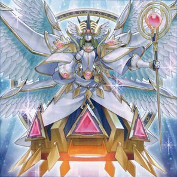

# 粛声 - 相性の良いカード

## 目次
- [粛声 - 相性の良いカード](#粛声---相性の良いカード)
  - [目次](#目次)
  - [光属性・ドラゴン族の儀式モンスター](#光属性ドラゴン族の儀式モンスター)
    - [古聖戴サウラヴィス](#古聖戴サウラヴィス)
    - [竜姫神サフィラ](#竜姫神サフィラ)
  - [その他メインデッキのモンスター](#その他メインデッキのモンスター)
    - [宣告者の神巫](#宣告者の神巫)
    - [トリアス・ヒエラルキア](#トリアスヒエラルキア)
  - [EXデッキのモンスター](#exデッキのモンスター)
    - [リンクリボー](#リンクリボー)
    - [セキュア・ガードナー](#セキュアガードナー)

## 光属性・ドラゴン族の儀式モンスター

### [古聖戴サウラヴィス](../General/ritual.md#古聖戴サウラヴィス)

- 「粛声なる守護者ローガーディアン」の効果①でサーチできるため、簡単に妨害数を増やせる

---

### [竜姫神サフィラ](../General/ritual.md#竜姫神サフィラ)

- 相性は悪くないが、「粛声なる竜神サフィラ」の存在からあまり採用されない。

## その他メインデッキのモンスター

### [宣告者の神巫](../General/ritual.md#宣告者の神巫)
- 【粛声】における初動の1つ
- 効果①で後述の「トリアス・ヒエラルキア」をデッキから墓地へ送ることで、「粛声の祈り手ロー」をリクルートできる。

  1. 「宣告者の神巫」を通常召喚
  1. 「宣告者の神巫」の効果①を発動する。 デッキから「トリアス・ヒエラルキア」を墓地へ送る。
  1. 「トリアス・ヒエラルキア」の効果①を発動する。 「宣告者の神巫」をリリースし、墓地から「トリアス・ヒエラルキア」を特殊召喚する。
  1. 「宣告者の神巫」の効果②を発動する。 デッキから「粛声の祈り手ロー」を特殊召喚する。

### トリアス・ヒエラルキア

|属性|種族|レベル|ATK|DEF|その他|
|---|---|---|---|---|---|
|光|天使|☆9|1900|2900|-|

|効果①||
|---|---|
|**種別**|誘発即時効果|
|**発動制限**|1ターンに1度(名称指定)|
|**制約**|この効果で特殊召喚したこのカードは、 フィールドから離れた場合に除外される。|
|**発動条件**|**1.** このカードが手札・墓地に存在 **2.** 自分・相手のメインフェイズ|
|**コスト**|自分フィールドの天使族モンスターを３体までリリースする|
|**対象**|-|
|**効果**|**1.** このカードを特殊召喚する。  **2.** この効果を発動するためにリリースしたモンスターの数によって以下の効果をそれぞれ適用できる。 　●２体以上：相手フィールドのカード１枚を選んで破壊する。 　●３体：自分はデッキから２枚ドローする。|

- 「宣告者の神巫」とあわせて「粛声の祈り手ロー」をリクルートするのに使う。
- フリーチェーンなので「墓穴の指名者」や【深淵の獣】をかわせる。

## EXデッキのモンスター

### リンクリボー

### セキュア・ガードナー
