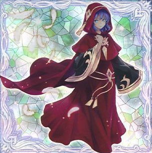
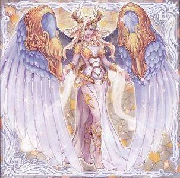
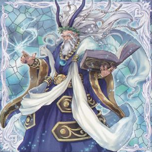
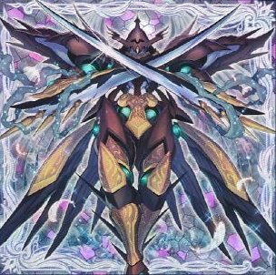
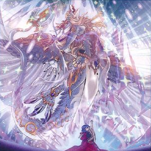

# 粛声 - モンスター

## 目次
- [粛声 - モンスター](#粛声---モンスター)
  - [目次](#目次)
  - [効果モンスター](#効果モンスター)
    - [粛声の祈り手ロー](#粛声の祈り手ロー)
    - [粛声の竜賢姫サフィラ](#粛声の竜賢姫サフィラ)
    - [粛声の竜賢聖サウラヴィス](#粛声の竜賢聖サウラヴィス)
  - [儀式モンスター](#儀式モンスター)
    - [粛声なる守護者ローガーディアン](#粛声なる守護者ローガーディアン)
    - [粛声なる竜神サフィラ](#粛声なる竜神サフィラ)

## 効果モンスター

### 粛声の祈り手ロー

|属性|種族|レベル|ATK|DEF|その他|
|---|---|---|---|---|---|
|光|天使|☆1|50|2050|-|

|効果①||
|---|---|
|**種別**|誘発効果・任意|
|**発動制限**|1ターンに1度(名称指定)|
|**制約**|-|
|**発動条件**|このカードが召喚・特殊召喚した場合|
|**コスト**|-|
|**対象**|-|
|**効果**|デッキから「粛声」永続魔法・永続罠カード１枚を自分の魔法＆罠ゾーンに表側表示で置く。|

|効果②||
|---|---|
|**種別**|未分類|
|**発動制限**|-|
|**制約**|-|
|**発動条件**|-|
|**コスト**|-|
|**対象**|-|
|**効果**|戦士族・ドラゴン族で光属性の儀式モンスター１体を儀式召喚する場合、 このカード１枚で儀式召喚に必要な分のリリースとして使用できる。|

|効果③||
|---|---|
|**種別**|誘発効果・任意|
|**発動制限**|1ターンに1度(名称指定)|
|**制約**|-|
|**発動条件**|**1.** このカードが墓地に存在 **2.** 自分フィールドに戦士族・ドラゴン族で 光属性の儀式モンスターが特殊召喚された場合|
|**コスト**|-|
|**対象**|-|
|**効果**|このカードを墓地から特殊召喚する。|

- 効果①は「灰流うらら」で妨害されない。

---

### 粛声の竜賢姫サフィラ

|属性|種族|レベル|ATK|DEF|その他|
|---|---|---|---|---|---|
|光|ドラゴン|☆6|2500|2400|-|

|効果①||
|---|---|
|**種別**|起動効果|
|**発動制限**|1ターンに1度(名称指定)|
|**制約**|-|
|**発動条件**|-|
|**コスト**|このカードを手札から捨てる。|
|**対象**|-|
|**効果**|**1.** デッキから儀式魔法カード１枚を墓地へ送る。 **2.** 戦士族・ドラゴン族で光属性の儀式モンスター１体を 自分のデッキ・墓地から手札に加える事ができる。|

|効果②||
|---|---|
|**種別**|起動効果|
|**発動制限**|1ターンに1度(名称指定)|
|**制約**|-|
|**発動条件**|-|
|**コスト**|墓地のこのカードを除外する。|
|**対象**|-|
|**効果**|手札から戦士族・ドラゴン族で光属性の儀式モンスター１体を儀式召喚する。 レベルの合計が儀式召喚するモンスターのレベル以上になるよう、儀式素材を以下aの方法で準備する。 **a.** 自分の手札・フィールドのモンスターをリリースする。|

---

### 粛声の竜賢聖サウラヴィス

|属性|種族|レベル|ATK|DEF|その他|
|---|---|---|---|---|---|
|光|ドラゴン|☆7|2600|2800|-|

|効果①||
|---|---|
|**種別**|未分類|
|**発動制限**|1ターンに1度(名称指定)|
|**制約**|-|
|**発動条件**|-|
|**コスト**|-|
|**対象**|-|
|**効果**|このカードは自分の手札・墓地から儀式魔法カードを含む 魔法カード２枚をデッキに戻し、手札から特殊召喚できる。|

|効果②||
|---|---|
|**種別**|誘発効果・任意|
|**発動制限**|1ターンに1度(名称指定)|
|**制約**|この効果で特殊召喚したモンスターは次のターンのエンドフェイズにデッキに戻る。|
|**発動条件**|相手がカードの効果を発動した時|
|**コスト**|フィールドのこのカードを手札に戻す。|
|**対象**|-|
|**効果**|手札・デッキから戦士族・ドラゴン族で 光属性の儀式モンスター１体を特殊召喚する。|

- 効果②は儀式召喚扱いでない点に注意

## 儀式モンスター

### 粛声なる守護者ローガーディアン

|属性|種族|レベル|ATK|DEF|その他|
|---|---|---|---|---|---|
|光|戦士|☆7|2050|2500|**儀式**|

|効果①||
|---|---|
|**種別**|誘発効果・任意|
|**発動制限**|1ターンに1度(名称指定)|
|**制約**|-|
|**発動条件**|このカードが儀式召喚した場合|
|**コスト**|-|
|**対象**|-|
|**効果**|デッキから「粛声」モンスターまたは戦士族・ドラゴン族の儀式モンスター１体を手札に加える。|

|効果②||
|---|---|
|**種別**|永続効果|
|**発動制限**|-|
|**制約**|-|
|**発動条件**|-|
|**コスト**|-|
|**対象**|-|
|**効果**|自分のフィールドか墓地に「粛声の祈り手ロー」が存在する限り、 このカードの攻撃力は２０５０アップする。|

|効果③||
|---|---|
|**種別**|誘発効果・任意|
|**発動制限**|1ターンに1度(名称指定)|
|**制約**|-|
|**発動条件**|**1.** 自分フィールドに「粛声の祈り手ロー」が存在 **2.** 相手が魔法・罠・モンスターの効果を発動した時|
|**コスト**|-|
|**対象**|-|
|**効果**|その効果の発動を無効にし破壊する。|

- 効果①のサーチ先儀式モンスターは種族指定のみ。属性指定は無い

---

### 粛声なる竜神サフィラ

|属性|種族|レベル|ATK|DEF|その他|
|---|---|---|---|---|---|
|光|ドラゴン|☆7|2550|2450|**儀式**|

|効果①||
|---|---|
|**種別**|誘発効果・任意|
|**発動制限**|1ターンに1度(名称指定)|
|**制約**|-|
|**発動条件**|**1.** 自分のフィールドか墓地に「粛声の祈り手ロー」が存在 **2.** このカードが儀式召喚した場合|
|**コスト**|-|
|**対象**|-|
|**効果**|**1.** 自分は２枚ドローする。 **2.** 自分の手札を１枚選んで捨てる。|

|効果②||
|---|---|
|**種別**|誘発効果・任意|
|**発動制限**|1ターンに1度(名称指定)|
|**制約**|-|
|**発動条件**|戦士族・ドラゴン族で光属性の儀式モンスターが戦闘を行う攻撃宣言時|
|**コスト**|-|
|**対象**|-|
|**効果**|相手の手札をランダムに１枚捨てる。|

|効果③||
|---|---|
|**種別**|誘発効果・任意|
|**発動制限**|1ターンに1度(名称指定)|
|**制約**|-|
|**発動条件**|相手ターンのエンドフェイズ時|
|**コスト**|-|
|**対象**|-|
|**効果**|自分の墓地から光属性モンスター１体を手札に加える。|

- 1つ1つの効果は強いが、安定性に欠ける
- 効果①が「金満で謙虚な壺」や「強欲で金満な壺」の発動後制約と被ってしまう点は注意
---

