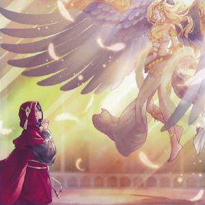
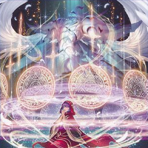
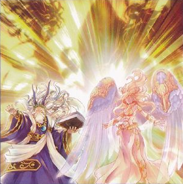
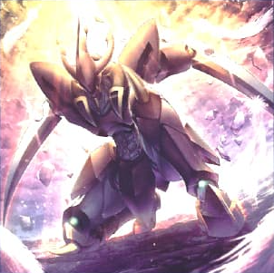

# 粛声 - 魔法・罠

## 目次
- [粛声 - 魔法・罠](#粛声---魔法罠)
  - [目次](#目次)
  - [魔法カード](#魔法カード)
    - [粛声なる祈り](#粛声なる祈り)
    - [粛声なる結界](#粛声なる結界)
    - [粛声なる祝福](#粛声なる祝福)
  - [罠カード](#罠カード)
    - [粛声なる威光](#粛声なる威光)
    - [粛声のガーディアン](#粛声のガーディアン)

## 魔法カード

### 粛声なる祈り

|種類|その他|
|---|---|
|儀式魔法|-|

|||
|---|---|
|**カードの発動制限**|-|

|効果①||
|---|---|
|**種別**|-|
|**発動制限**|-|
|**制約**|-|
|**発動条件**|-|
|**コスト**|-|
|**対象**|-|
|**効果**|手札から光属性の儀式モンスター１体を儀式召喚する。 レベルの合計が儀式召喚するモンスターのレベル以上になるよう、儀式素材を以下aの方法で準備する。 　**a.** 自分の手札・フィールドの光属性モンスターをリリースする。|

|効果②||
|---|---|
|**種別**|誘発効果・任意|
|**発動制限**|1ターンに1度(名称指定)|
|**制約**|-|
|**発動条件**|自分フィールドの表側表示の光属性の儀式モンスターが相手の効果でフィールドから離れた場合|
|**コスト**|墓地のこのカードを除外|
|**対象**|-|
|**効果**|手札・デッキから「古聖戴サウラヴィス」「竜姫神サフィラ」 「粛声なる守護者ローガーディアン」のいずれか１体を召喚条件を無視して特殊召喚する。|

- 光属性しか儀式素材にできない点は注意

---

### 粛声なる結界

|種類|その他|
|---|---|
|永続魔法|-|

|||
|---|---|
|**カードの発動制限**|-|

|効果①||
|---|---|
|**種別**|永続効果|
|**発動制限**|-|
|**制約**|-|
|**発動条件**|-|
|**コスト**|-|
|**対象**|-|
|**効果**|自分フィールドに「粛声の祈り手ロー」及び光属性の儀式モンスターが存在する限り、以下が適用される。 ・相手モンスターは儀式モンスターしか攻撃対象に選択できない。 ・相手は自分フィールドの光属性モンスターを効果の対象にできない。|

|効果②||
|---|---|
|**種別**|起動効果|
|**発動制限**|1ターンに1度(名称指定)|
|**制約**|-|
|**発動条件**|-|
|**コスト**|-|
|**対象**|-|
|**効果**|以下a,b**どちらか**をデッキから手札に加える。 　**a.** 「粛声なる結界」以外の「粛声」カード１枚 　**b.** 「ローガーディアン」儀式モンスター１体|

---

### 粛声なる祝福

|種類|その他|
|---|---|
|永続魔法|-|

|||
|---|---|
|**カードの発動制限**|-|

|効果①||
|---|---|
|**種別**|起動効果|
|**発動制限**|1ターンに1度(名称指定)|
|**制約**|-|
|**発動条件**|-|
|**コスト**|-|
|**対象**|「粛声なる祝福」以外の自分の墓地・除外状態の「粛声」カード１枚|
|**効果**|対象のカードを手札に加える。|

|効果②||
|---|---|
|**種別**|誘発効果・任意|
|**発動制限**|1ターンに1度(名称指定)|
|**制約**|-|
|**発動条件**|儀式モンスター以外のモンスターが表側表示で召喚・特殊召喚された場合|
|**コスト**|-|
|**対象**|-|
|**効果**|**1.** 手札から戦士族・ドラゴン族で光属性の儀式モンスター１体を儀式召喚する。 レベルの合計が儀式召喚するモンスターのレベル以上になるよう、儀式素材を以下aの方法で準備する。 　**a.** 自分の手札・フィールドのモンスターをリリースする。  **2.** この効果で特殊召喚したモンスターは戦闘では破壊されない。|

- 効果②は儀式素材の条件、特殊召喚できる儀式モンスターの範囲が「粛声なる祈り」と違う点に注意。

## 罠カード

### 粛声なる威光

|種類|その他|
|---|---|
|永続罠|-|

|||
|---|---|
|**カードの発動制限**|-|

|効果①||
|---|---|
|**種別**|誘発即時効果|
|**発動制限**|1ターンに1度(名称指定)|
|**制約**|-|
|**発動条件**|自分・相手のメインフェイズ|
|**コスト**|-|
|**対象**|-|
|**効果**|効果①-1、効果①-2から１つを選択して発動できる。|

|効果①-1|※効果①から発動される|
|---|---|
|**種別**|-|
|**発動制限**|-|
|**制約**|-|
|**発動条件**|-|
|**コスト**|-|
|**対象**|-|
|**効果**|**1.** 自分の手札・墓地から以下a,bどちらかのカードをデッキに戻す。 　**a.** 戦士族・ドラゴン族で光属性の儀式モンスター１体 　**b.** 儀式魔法カード１枚  **2.** デッキから「粛声」モンスター１体を選び、手札に加えるか特殊召喚する。|

|効果①-2|※効果①から発動される|
|---|---|
|**種別**|-|
|**発動制限**|-|
|**制約**|-|
|**発動条件**|-|
|**コスト**|-|
|**対象**|相手フィールドのカード ※自分フィールドの戦士族・ドラゴン族で光属性の儀式モンスターの数まで指定可能|
|**効果**|対象のカードとこのカードを破壊する。|

---

### 粛声のガーディアン

|種類|その他|
|---|---|
|永続罠|-|

|||
|---|---|
|**カードの発動制限**|-|

|効果①||
|---|---|
|**種別**|誘発効果・任意|
|**発動制限**|1ターンに1度(名称指定) 効果②と同一チェーン上で発動不可|
|**制約**|-|
|**発動条件**|儀式モンスター以外の自分フィールドのモンスターが戦闘・効果で破壊された場合|
|**コスト**|-|
|**対象**|-|
|**効果**|手札・デッキから「ローガーディアン」１体を特殊召喚する。|

|効果②||
|---|---|
|**種別**|誘発即時効果|
|**発動制限**|1ターンに1度(名称指定) 効果②と同一チェーン上で発動不可|
|**制約**|-|
|**発動条件**|-|
|**コスト**|魔法＆罠ゾーンの表側表示のこのカードを墓地へ送る|
|**対象**|自分フィールドの儀式モンスター１体|
|**効果**|対象のモンスターの攻撃力はターン終了時まで、フィールドの他のモンスターの元々の攻撃力の合計分アップする。|

- 【粛声】ではほぼ使われない
- 粛声名称だが、効果①で「[粛声なるローガーディアン](./themeMonsterCards.md#粛声なる守護者ローガーディアン)」を特殊召喚できない。
- ②の効果は儀式モンスターの打点をフリーチェーンで底上げできる
  - 4100を超える　ダメージステップ時にも発動可能。

